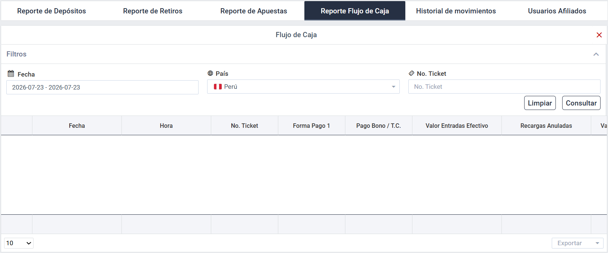

# Historial de movimientos

***

### 1. Acceso al Módulo

**Ruta de Acceso**: BackOffice > Menú principal > Gestión punto de venta > 🔍 Ingresar a punto de venta > Reportes > Historial de movimientos.

***

### 2. Visualización

<figure><figcaption>
Figura #1: Captura de pantalla reporte flujo de caja.
</figcaption></figure>

***

### 3.  Acciones de usuario

<table><thead><tr><th width="170.4444580078125">Acción</th><th>Descripción</th></tr></thead><tbody><tr><td><a href="https://virtualsoft.gitbook.io/manuales/manual-de-usuario-backoffice/gestion-punto-de-venta/punto-de-venta/reportes/reporte-de-retiros#id-4.-filtros"><strong>Filtros</strong></a></td><td>Permite buscar el historial de los retiros realizados por el punto de venta con la ayuda de filtros.</td></tr><tr><td><strong>Limpiar</strong></td><td>Restablece los filtros por defecto.</td></tr><tr><td><a href="https://virtualsoft.gitbook.io/manuales/manual-de-usuario-backoffice/gestion-punto-de-venta/punto-de-venta/reportes/reporte-de-retiros#id-5.-resultado-de-consulta"><strong>Consultar</strong></a></td><td>Aplica los filtros configurados y obtén los resultados.</td></tr><tr><td><strong>Exportar</strong></td><td>Permite exportar los resultados obtenidos según los filtros aplicados en formatos Excel <em>(.XLS)</em> y PDF mediante el botón <strong>Exportar</strong>, ubicado en la parte inferior derecha de la pantalla.</td></tr></tbody></table>

### 4. Filtros

<table><thead><tr><th width="135.25">Campo</th><th width="117.25">Tipo de control</th><th>Descripción</th></tr></thead><tbody><tr><td><strong><code>Fecha</code></strong></td><td>Calendario</td><td>Rango de fechas en la cual se realizaron los Retiros.</td></tr><tr><td><strong><code>País</code></strong></td><td></td><td></td></tr><tr><td><strong><code>No. Ticket</code></strong></td><td></td><td></td></tr></tbody></table>

### 5. Resultado de Consulta

El reporte de solitudes de retiro se visualizará en una tabla que contiene las siguientes columnas:

<table><thead><tr><th width="140.25">Columna</th><th>Descripción</th></tr></thead><tbody><tr><td>🔍</td><td></td></tr></tbody></table>

***

### 6. Control de Versiones

🔽Historial de versiones

<table><thead><tr><th width="119.14813232421875">Versión</th><th width="130.77777099609375">Fecha</th><th width="164.5555419921875">Autor</th><th>Cambios Realizados</th></tr></thead><tbody><tr><td>1.0</td><td>2026-07-23</td><td>Ronald Peláez</td><td>Documento inicial</td></tr></tbody></table>

