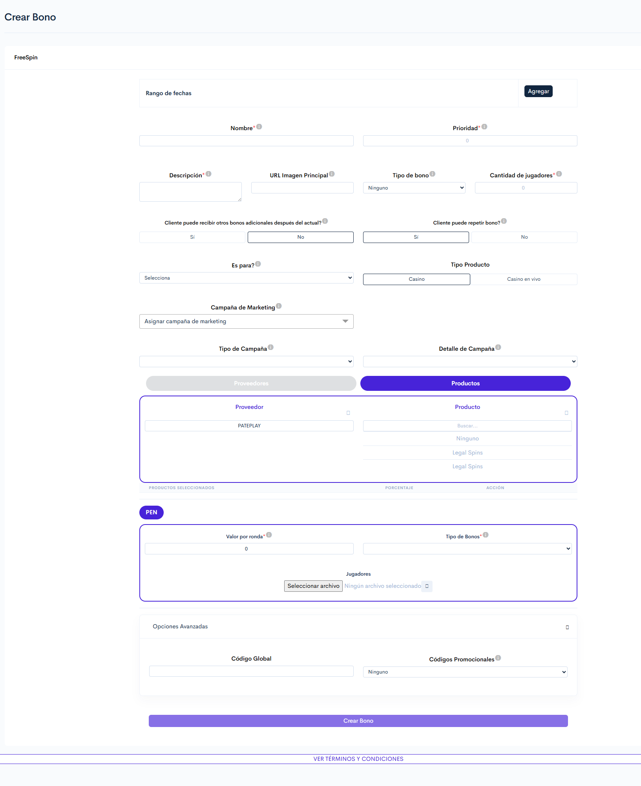

# Pateplay

### 1. Acceso al Módulo:

**Ruta de Acceso**: BackOffice > Torneos y Bonos > Bono FreeSpin

***

### 2. Visualización:

<figure><figcaption>
Figura#1: Captura de pantalla creación bono freeSpin.
</figcaption></figure>

### **3. Formulario para creación de bonos.**

Estas son las configuraciones principales y necesarias para generar un bono FreeSpin con los juegos del proveedor Pateplay, en caso de necesitar información más detallada sobre cómo crear el bono FreeSpin, puedes acceder a la siguiente página:


[FreeSpin](https://app.gitbook.com/s/rLdGx9JdTz3uLoquKvJw/torneos-y-bonos./como-acceder-a-la-plataforma-./crear-eventos./crear-bono./freespin)


<table><thead><tr><th width="124.44451904296875">Sección</th><th width="110">Tipo de control</th><th>Descripción</th></tr></thead><tbody><tr><td><strong><code>Rango de fechas</code></strong></td><td>Selector de fecha + botón Agregar</td><td>Define la fecha de inicio y finalización en la que el bono estará activo.</td></tr><tr><td><strong><code>Nombre</code></strong></td><td>Campo de texto</td><td>Define el nombre que se asignará al bono.</td></tr><tr><td><strong><code>Prioridad</code></strong></td><td>Campo numérico</td><td>
Permite definir la prioridad del bono, lo que determina el orden en que se asignarán los bonos a los usuarios. Un número más alto significa una mayor prioridad.

<strong>Ejemplo:</strong> Si hay tres bonos configurados con las siguientes prioridades: 
<ul><li><strong>Bono A</strong>: 1</li><li><strong>Bono B</strong>: 2</li><li><strong>Bono C</strong>: 3</li></ul>
El sistema dará preferencia al B<strong>ono C</strong> al momento de la activación, ya que tiene la prioridad más alta. Esto asegura que los usuarios siempre reciban primero el bono con mayor relevancia según la configuración.

</td></tr><tr><td><strong><code>Descripción</code></strong></td><td>Campo de texto</td><td>Breve explicación de las condiciones o características del bono.</td></tr><tr><td><strong><code>URL imagen principal</code></strong></td><td>URL</td><td>Inserta la URL de la imagen principal del bono.</td></tr><tr><td><strong><code>Cantidad de jugadores</code></strong></td><td>Numérico</td><td>Define el número total de usuarios que recibirán el bono.</td></tr><tr><td><strong><code>Cliente puede recibir otros bonos adicionales después del actual?</code></strong></td><td> Botón de selección</td><td>Indica si el usuario podrá acumular bonos adicionales al actual que se está creando.</td></tr><tr><td><strong><code>Cliente puede repetir bono?</code></strong></td><td> Botón de selección</td><td>Define si el usuario puede <a href="https://virtualsoft.gitbook.io/untitled/glosario#redimir">redimir</a> más de una vez el mismo bono.</td></tr><tr><td><strong><code>Tipo producto</code></strong></td><td> Botón de selección</td><td>Para el caso de "<strong>pateplay</strong>"<strong>,</strong> selecciona <strong>Casino</strong>.</td></tr><tr><td><strong><code>Proveedor</code></strong></td><td>Botón</td><td>Selecciona el proveedor del bono, en este caso "<strong>pateplay</strong>".</td></tr><tr><td><strong><code>Productos</code></strong></td><td>Botón</td><td>Lista los juegos disponibles del proveedor seleccionado, se debe elegir el juego en el que estará disponible el bono.</td></tr><tr><td><strong><code>Moneda</code></strong></td><td>Botón</td><td>
Al seleccionar la moneda, se habilitarán las configuraciones correspondientes, las cuales variarán según el <strong><code>tipo de bono</code></strong> que se seleccione.

<a href="https://virtualsoft.gitbook.io/manuales/integraciones./manual-integraciones-por-proveedor./proveedores-con-configuraciones-para-bonos./pateplay#moneda" class="button secondary">Configuraciones por moneda</a>
</td></tr></tbody></table>

<strong>Moneda.</strong>

Al seleccionar la moneda se desplegarán las siguientes configuraciones:

<table><thead><tr><th width="117">Campo</th><th width="154">Tipo de control</th><th>Descripción</th></tr></thead><tbody><tr><td><strong><code>Valor por ronda</code></strong></td><td>Numérico</td><td>Indica el valor que tendrá el bono por cada ronda jugada.</td></tr><tr><td><strong><code>Tipo de bono</code></strong></td><td>Lista desplegable</td><td>Establece que tipo de bono, para desplegar las configuraciones correspondientes. <a href="https://virtualsoft.gitbook.io/manuales/integraciones./manual-integraciones-por-proveedor./proveedores-con-configuraciones-para-bonos./pateplay#tipos-de-bonos-disponibles" class="button secondary">Tipos de bonos disponibles.</a></td></tr><tr><td><strong><code>Jugadores</code></strong></td><td>Archivo CSV</td><td>Ingresa un archivo CSV con los id´s de los jugadores que tendrán acceso al bono.</td></tr></tbody></table>

<strong>Tipos de bonos disponibles.</strong>

Cada tipo de bono desplegará un campo correspondiente para su configuración.

<table><thead><tr><th width="138">Tipo de bono</th><th width="293">Descripción</th><th>Campos a configurar</th></tr></thead><tbody><tr><td><strong><code>Bets</code></strong> </td><td>El bono se asignará al usuario con una cantidad predefinida de rondas gratuitas, conforme a la configuración establecida.</td><td><ul><li><strong><code>Rondas gratuitas</code></strong>: Establece la cantidad de rondas que tendrá el bono.</li></ul></td></tr><tr><td><strong><code>sure_win</code></strong></td><td>El bono otorgará rondas gratuitas de manera continua hasta que el usuario obtenga una ganancia en alguna de ellas.</td><td><ul><li><strong><code>Valor por ronda</code>:</strong> Indica el valor que tendrá el bono por cada ronda jugada. </li></ul></td></tr><tr><td><strong><code>Infinity</code></strong></td><td>El bono se asignará al usuario con giros ilimitados durante un período de tiempo previamente definido.</td><td><ul><li><strong><code>Duración</code></strong>: Define el tiempo, expresado en segundos, durante el cual estará activo el bono con giros ilimitados para el usuario.</li></ul></td></tr></tbody></table>

Para guardar y crear el bono se debe seleccionar el botón "**Guardar**"

***

Los reportes sobre este bono estarán disponibles en la reportería de _Productos No Deportivos_.


[Reporte productos no deportivos](https://app.gitbook.com/s/UadX6RX6l8fMhEZxOqcT/manual-de-usuario-backoffice/reportes/reporte-productos-no-deportivos)


***

### **4. Validaciones y Reglas de Negocio**

* El bono se crea de forma inmediata, pero la asignación a jugadores puede tardar entre **2 y 3 minutos**.
* El bono solo se puede configurar para un único juego, en caso de seleccionar varios juegos simultáneamente, el sistema asignará el bono únicamente a uno de ellos de forma aleatoria.
* Si se ingresa un valor erróneo en el campo **`Valor por ronda`** el bono se creará, pero no se le asignará al usuario.

***

### &#x20;**5. Control de Versiones**

| Versión | Fecha      | Autor         | Cambios Realizados                                       |
| ------- | ---------- | ------------- | -------------------------------------------------------- |
| 1.0     | 06/11/2025 | David Ortiz   | Documento inicial                                        |
| 1.1     | 17/02/2026 | Ronald Peláez | Refinamiento de manual por actualización con el partner. |
