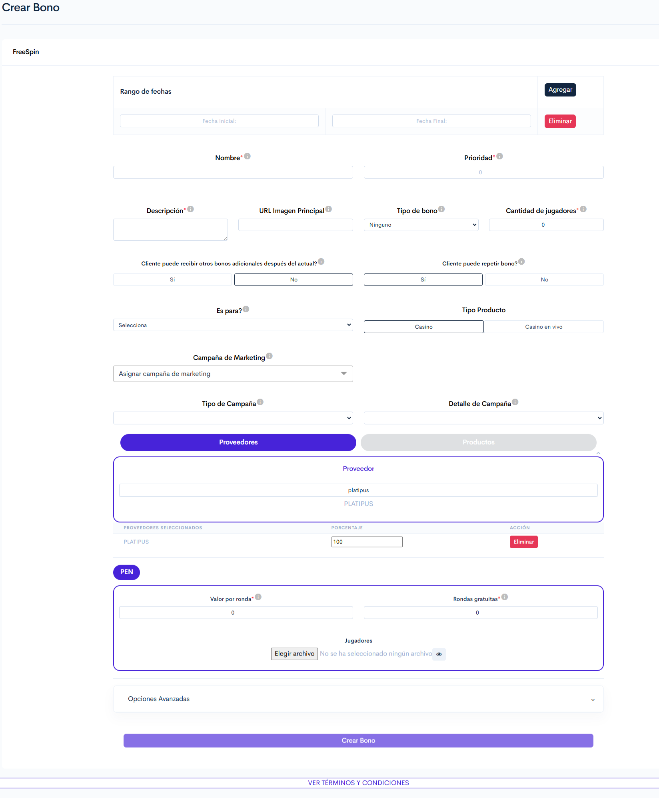

# PLATIPUS.

### 1. Acceso al Módulo:

**Ruta de Acceso**: Torneos y bonos > Crear bono > Seleccionar País > FreeSpin

***

### 2. Visualización:

<figure><figcaption>
Figura#1: Captura de pantalla creación bono Free Spin.
</figcaption></figure>

### **3. Formulario para creación de bonos** PLATIPUS

Estas configuraciones corresponden a los campos que pueden presentar comportamientos específicos o variaciones propias del proveedor **PLATIPUS** dentro del proceso de creación de bonos FreeSpin.

Para consultar el detalle completo de los demás campos y la configuración general del bono, se recomienda acceder a la documentación principal indicada a continuación.



<table><thead><tr><th width="127.90740966796875">Sección</th><th width="108.126220703125">Tipo de control</th><th>Descripción</th></tr></thead><tbody><tr><td><strong><code>Rango de fechas</code></strong></td><td>Selector de fecha + botón</td><td>
Define la fecha de inicio y finalización en la que el bono estará disponible.

<strong>Notas:</strong> 
<ul><li>La fecha de finalización debe ser siempre posterior a la fecha de inicio. Se recomienda configurar algunos minutos de holgura en la fecha de inicio para asegurar la correcta creación y activación del bono.</li></ul>
</td></tr><tr><td><strong><code>Proveedor</code></strong></td><td>Botón</td><td>
Selecciona el proveedor del bono, en este caso "<strong>PLATIPUS</strong>".

<strong>Nota:</strong> Al seleccionar el juego correspondiente se desplegará una tabla en la que se indicará que porcentaje del bono será asumido por el proveedor <strong>PLATIPUS.</strong>

</td></tr><tr><td><strong><code>Productos</code></strong></td><td>Botón</td><td>
Selecciona uno o múltiples juegos a los cuales aplicará el bono.

<strong>Nota:</strong> Los giros gratis solo podrán utilizarse en uno de los juegos seleccionados, a elección del usuario. Una vez se utilice el primer giro en un juego, la totalidad de los giros quedará asociada a ese juego y no podrá utilizarse en los demás.

<strong>Ejemplo:</strong> Si el bono tiene <strong>6 giros</strong> y se seleccionan varios juegos, el usuario podrá elegir cualquiera de ellos para utilizarlos. Sin embargo, al realizar el primer giro en un juego, los <strong>6 giros</strong> quedarán disponibles únicamente para ese juego hasta ser consumidos.

</td></tr><tr><td><strong><code>Moneda</code></strong></td><td>Botón</td><td>Al seleccionar la moneda, se activarán las siguientes configuraciones. <a href="platipus..md#configuracion-de-moneda" class="button secondary">Configuraciones disponibles</a></td></tr></tbody></table>

🔽 Configuración de moneda

<table><thead><tr><th width="112.5185546875">Campo</th><th width="126.0369873046875">Tipo de control</th><th>Descripción</th></tr></thead><tbody><tr><td><strong><code>Valor por ronda</code></strong></td><td>Campo numérico</td><td>
Defina el <strong>valor base</strong> que desea asignar a cada ronda del juego. Para calcularlo, <strong>divida entre 5</strong> el <strong>valor final</strong> que desea otorgar al jugador, ya que el proveedor multiplica automáticamente el monto configurado por las <strong>5</strong> líneas del juego.

<strong>Nota:</strong> El valor final que recibirá el jugador, es decir, el resultado obtenido después de <strong>multiplicar por 5</strong> el <strong>valor base</strong> configurado en <strong>este campo.</strong> El <strong>valor base</strong> configurado debe corresponder a uno de los valores permitidos por el juego seleccionado. Si el valor ingresado no coincide con un valor válido del juego, el bono no podrá ser asignado.

<strong>Ejemplo:</strong> Si desea entregar <strong>10</strong> al usuario por ronda, debe ingresar un <strong>valor base de 2</strong> en este campo, ya que el proveedor multiplicará automáticamente ese valor por las <strong>5</strong> líneas del juego <strong>(2 × 5 = 10)</strong>. Ese <strong>valor base de 2</strong> debe estar entre los valores disponibles permitidos por el juego.

</td></tr><tr><td><strong><code>Rondas gratuitas</code></strong></td><td>Numérico</td><td>Establece la cantidad de giros gratis que tendrá este bono.</td></tr><tr><td><strong><code>Jugadores</code></strong></td><td>Botón "Seleccionar archivo"</td><td>
Permite cargar un archivo en formato <a href="https://virtualsoft.gitbook.io/plantillas/glosario#csv">CSV</a> con los IDs de los jugadores que recibirán el bono.

<strong>Nota:</strong> El archivo debe contener únicamente una columna con los IDs de los jugadores. Si el archivo incluye columnas adicionales o un formato diferente, será rechazado.

</td></tr></tbody></table>

<a href="platipus..md#id-3.-formulario-para-creacion-de-bonos-skywind" class="button secondary">Regresar</a>

Finaliza la configuración del bono guardando y aplicando las configuraciones realizadas desde el botón "**`Crear Bono`**".

***

* La información de este bono estará disponible en la reportería de _Productos No Deportivos_.


**Nota:** Si se realiza una compra de giros en la tienda del proveedor, las ganancias de estos giros se reportarán como "**Premios**" y no como "**Premios bonos**"



[Reporte productos no deportivos](https://app.gitbook.com/s/UadX6RX6l8fMhEZxOqcT/manual-de-usuario-backoffice/reportes/reporte-productos-no-deportivos)


* La información sobre los movimientos realizados por el usuario con este bono estará disponible en la reportería _Historial de movimientos._


[Historial de movimientos](https://app.gitbook.com/s/UadX6RX6l8fMhEZxOqcT/manual-de-usuario-backoffice/jugadores/reportes-seccion-jugadores/historial-de-movimientos)


***

### **4. Validaciones y Reglas de Negocio**

* El bono se crea de forma inmediata, pero la asignación a jugadores puede tardar entre **2 y 3 minutos**.
* El bono puede configurarse para múltiples juegos. Sin embargo, la cantidad de tiradas configuradas es única y compartida entre todos los juegos seleccionados, por lo que las tiradas podrán utilizarse en cualquiera de los juegos disponibles, pero no se asignarán de forma individual a cada uno.
* Este bono una vez creado quedará disponible para **CRM optimove**.
* Si el valor final por ronda configurado se encuentra dentro del rango de cuotas permitido por el juego, el bono podrá asignarse correctamente, aunque el valor no exista explícitamente en la lista de cuotas disponibles.
* Si el valor configurado está fuera del rango permitido por el juego, el bono se creará, pero no podrá ser asignado a los usuarios.

***

### &#x20;**5. Control de Versiones**

🔽 Historial de versiones.

| Versión | Fecha      | Autor           | Cambios Realizados |
| ------- | ---------- | --------------- | ------------------ |
| 1.0     | 24/06/2025 | David Velásquez | Documento inicial  |

