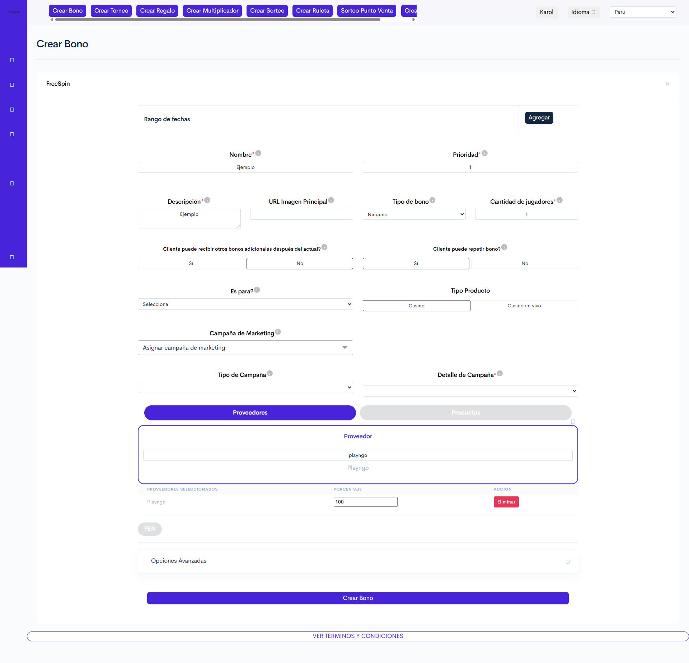

# PLAYNGO.

### 1. Acceso al Módulo:

**Ruta de Acceso**: Torneos y bonos > Crear bono > Seleccionar País > FreeSpin

***

### 2. Visualización

<figure><figcaption>
Figura#1: Captura de pantalla creación bono Free Spin.
</figcaption></figure>

### **3. Formulario para creación de bonos** PLAYNGO

Estas configuraciones corresponden a los campos que pueden presentar comportamientos específicos o variaciones propias del proveedor **PLAYNGO** dentro del proceso de creación de bonos FreeSpin.

Para consultar el detalle completo de los demás campos y la configuración general del bono, se recomienda acceder a la documentación principal indicada a continuación.



<table><thead><tr><th width="140.5">Sección</th><th width="108.126220703125">Tipo de control</th><th>Descripción</th></tr></thead><tbody><tr><td><strong><code>Rango de fechas</code></strong></td><td>Selector de fecha + botón</td><td>
Define la fecha de inicio y finalización en la que el bono estará disponible.

<strong>Notas:</strong> 
<ul><li>La fecha de finalización debe ser siempre posterior a la fecha de inicio. Se recomienda configurar algunos minutos de holgura en la fecha de inicio para asegurar la correcta creación y activación del bono.</li><li>El rango de fecha máximo para la vigencia de un bono con este proveedor es de 30 días.</li></ul>
</td></tr><tr><td><strong><code>Proveedor</code></strong></td><td>Botón</td><td>
Selecciona el proveedor del bono, en este caso "<strong>PLAYNGO</strong> ".

<strong>Nota:</strong> Al seleccionar el juego correspondiente se desplegará una tabla en la que se indicará que porcentaje del bono será asumido por el proveedor <strong>PLAYNGO.</strong>

</td></tr><tr><td><strong><code>Productos</code></strong></td><td>Botón</td><td>Selecciona el juego <em>(producto)</em> para el cual aplicará el bono.</td></tr><tr><td><strong><code>Moneda</code></strong></td><td>Botón</td><td>Al seleccionar la moneda, se activarán las siguientes configuraciones. <a href="playngo..md#configuracion-de-moneda" class="button secondary">Configuraciones disponibles</a></td></tr></tbody></table>

🔽 Configuración de moneda

<table><thead><tr><th width="114">Campo</th><th width="129">Tipo de control</th><th>Descripción</th></tr></thead><tbody><tr><td><strong><code>Rondas gratuitas</code></strong></td><td>Numérico</td><td>Establece la cantidad de giros gratis que tendrá este bono.</td></tr><tr><td><strong>Código de plantilla</strong></td><td>Numérico</td><td>Cuando se crea una campaña de PLAYNGO, se genera un código que actúa como código de plantilla. La campaña es creada por el equipo de Marketing desde el BackOffice de PLAYNGO, al momento de crear este código también se debe configurar el valor por ronda del bono.</td></tr><tr><td><strong><code>Jugadores</code></strong></td><td>Botón "Seleccionar archivo"</td><td>Permite cargar un archivo en formato CSV con los ID de los jugadores que recibirán el bono.</td></tr></tbody></table>

<a href="playngo..md#id-3.-formulario-para-creacion-de-bonos-playngo" class="button secondary">Regresar</a>

Finaliza la configuración del bono guardando y aplicando las configuraciones realizadas desde el botón "**`Crear Bono`**".

***

* La información de este bono estará disponible en la reportería de _Productos No Deportivos_.


Nota: Si se realiza una compra de giros en la tienda del proveedor, las ganancias de estos giros se reportaran como "**Premios**" y no como "**Premios bonos**"



[Reporte productos no deportivos](https://app.gitbook.com/s/UadX6RX6l8fMhEZxOqcT/manual-de-usuario-backoffice/reportes/reporte-productos-no-deportivos)


* La información sobre los movimientos realizados por el usuario con este bono estará disponible en la reportería _Historial de movimientos._


**Nota:** El historial de movimientos mostrará un registro independiente por cada jugada gratuita realizada.



[Historial de movimientos](https://app.gitbook.com/s/UadX6RX6l8fMhEZxOqcT/manual-de-usuario-backoffice/jugadores/reportes-seccion-jugadores/historial-de-movimientos)


***

### **4. Validaciones y Reglas de Negocio**

* El bono se crea de forma inmediata, pero la asignación a jugadores puede tardar entre **2 y 3 minutos**.
* El bono solo puede configurarse para un único juego. Si se seleccionan varios, no se creará el bono y generará un error interno.
* Este bono una vez creado quedará disponible para **CRM optimove**.
* Si se crea un bono con un valor por ronda diferente a los permitidos en la lista de cuotas por juego, el sistema asignará automáticamente el valor de apuesta permitido más bajo disponible según la moneda configurada para el juego.

***

### &#x20;**5. Control de Versiones**

🔽Historial de versiones.

<table><thead><tr><th width="105.8148193359375">Versión</th><th width="123">Fecha</th><th width="124.2220458984375">Autor</th><th>Cambios Realizados</th></tr></thead><tbody><tr><td>1.0</td><td>06/06/2026</td><td>Karol Navia</td><td>Reestructuración del manual conforme a la plantilla.</td></tr></tbody></table>

