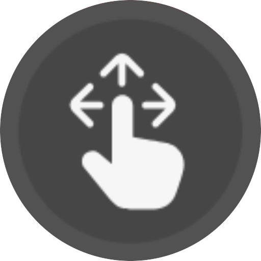

---
layout:
  width: default
  title:
    visible: true
  description:
    visible: false
  tableOfContents:
    visible: true
  outline:
    visible: true
  pagination:
    visible: true
  metadata:
    visible: true
  tags:
    visible: true
  actions:
    visible: true
---

# Menú

<mark style="color:$info;">Administra las categorías y los elementos gráficos que serán visualizados en el menú principal de la plataforma. Desde esta sección es posible crear categorías personalizadas y configurar GIF promocionales que serán presentados a los usuarios.</mark>

***

### 1. Acceso al Módulo

**Ruta de Acceso:** Backoffice > Configuración > Menú

***

### 2. **Configuraciones previas.**

Antes de realizar las acciones disponibles en la sección pop ups, es necesario contar con las siguientes configuraciones:

<table><thead><tr><th width="170.6666259765625">Parámetro</th><th>Descripción</th></tr></thead><tbody><tr><td><strong><code>País</code></strong></td><td>Define el país sobre el cual se aplicará la configuración del menú.</td></tr><tr><td><strong><code>Dispositivo</code></strong></td><td>Define el dispositivo para el cual se configurará el menú.</td></tr><tr><td><strong><code>Modo de Logueo</code></strong></td><td>Establece el modo de autenticación sobre el cual se aplicará la configuración.</td></tr></tbody></table>

***

### 3. Acciones disponibles

<table><thead><tr><th width="178.4444580078125">Acción</th><th>Descripción</th></tr></thead><tbody><tr><td><a href="menu.md#id-4.-agregar"><strong>Agregar (+)</strong></a></td><td>Crea una nueva categoría o un nuevo GIF según la opción seleccionada.</td></tr><tr><td><strong>Guardar</strong></td><td>Guarda los cambios realizados en la configuración del menú.</td></tr><tr><td><strong>Mover</strong></td><td>Reorganiza la posición de una categoría dentro del menú.</td></tr><tr><td><strong>Eliminar</strong></td><td>Elimina la categoría o el GIF seleccionado.</td></tr></tbody></table>

***

### 4. Agregar



Crear nuevas accesos que serán visualizados dentro del menú principal de la plataforma.

### **Visualización**

<figure><figcaption>
Figura #1: Captura de pantalla Categorias de menú.
</figcaption></figure>

### **Configuración**

<table><thead><tr><th width="131" align="center">Campo</th><th>Descripción</th></tr></thead><tbody><tr><td align="center"></td><td>Agrega una nueva categoría al menú.</td></tr><tr><td align="center"></td><td>Sube la imagen que identificará la categoría dentro del menú.</td></tr><tr><td align="center"><strong><code>Título</code></strong></td><td>Registra el nombre que será mostrado para la categoría.</td></tr><tr><td align="center"><strong><code>URL de redirección</code></strong></td><td>Registra la dirección web a la que será dirigido el usuario al presionar la categoría.</td></tr><tr><td align="center"></td><td>
Modifica la posición de la categoría dentro del menú.

<strong>Importante:</strong> El orden en que se organizan las categorías en esta sección corresponde al mismo orden en que serán visualizadas dentro de la plataforma.

</td></tr><tr><td align="center"></td><td>Elimina la categoría seleccionada.</td></tr></tbody></table>



Incorpora elementos gráficos animados al inicio del menú principal para destacar promociones, campañas o accesos específicos.

### **Visualización**

<figure><figcaption>
Figura #1: Captura de pantalla Gif.
</figcaption></figure>

### **Configuración**

<table><thead><tr><th width="129">Campo</th><th width="124">Tipo</th><th>Descripción</th></tr></thead><tbody><tr><td>         </td><td>Botón</td><td>Despliega el formulario para crear un nuevo GIF</td></tr><tr><td><strong><code>Vista Previa</code></strong></td><td>Imagen</td><td>Presenta una simulación del GIF con la configuración realizada antes de guardar los cambios.</td></tr><tr><td>        </td><td>Botón</td><td>Arrastra los gifs configurados para asignarle un orden en la plataforma Usuarios Online.</td></tr><tr><td>       </td><td></td><td></td></tr><tr><td>        </td><td></td><td></td></tr></tbody></table>

<strong>Formulario para creación de un GIF</strong>

<table><thead><tr><th width="148">Campo</th><th width="131">Tipo</th><th>Descripción</th></tr></thead><tbody><tr><td><strong><code>Fondo degradado</code></strong></td><td>Selector de color</td><td>Define los colores que conformarán el fondo del GIF.</td></tr><tr><td><strong><code>Imagen izquierda</code></strong></td><td>Imagen</td><td>Registra la imagen que acompañará el GIF al lado derecho.</td></tr><tr><td><strong><code>GIF</code></strong></td><td>Imagen animada</td><td>Archivo GIF que será visualizado en la plataforma.</td></tr><tr><td><strong><code>URL de redirección</code></strong></td><td>URL</td><td>Dirección web que será redirigido al presionar el GIF.</td></tr></tbody></table>




***

### 5. Validaciones y reglas del negocio

* Las imágenes utilizadas para las categorías deben estar en formato **PNG**.
* El tamaño máximo permitido para las imágenes es de **200 KB**.
* Los GIF siempre se visualizarán al inicio del menú principal.
* El orden configurado para las categorías corresponde al mismo orden en que serán presentadas en la plataforma.
* Las modificaciones realizadas se almacenan únicamente al hacer clic en **Guardar**.

***

### 6. Control de Versiones

🔽 Historial de versiones

<table><thead><tr><th width="108.3333740234375">Versión</th><th width="141">Fecha</th><th width="118">Autor</th><th>Cambios Realizados</th></tr></thead><tbody><tr><td>1.0</td><td>05/08/2026</td><td><strong>Karol Navia</strong></td><td><a href="https://virtualsoftlatam.atlassian.net/browse/VSFT-32812">Reestructuración adaptado a plantilla.</a></td></tr></tbody></table>

