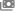

# Pop ups


**Nota**: Este módulo solo estará disponible si se cuentan con los permisos necesarios.


### **1. Acceso al Módulo**

**Ruta:** Site Builder > Seleccionar Partner > Apariencia > Pop ups

***

### **2. Configuraciones previas.**

Antes de realizar las acciones disponibles en la sección pop ups, es necesario contar con las siguientes configuraciones:

<table><thead><tr><th width="159.55560302734375">Parámetro</th><th width="580.4443969726562">Descripción</th></tr></thead><tbody><tr><td><strong><code>Pais</code></strong></td><td>Indica el país para el cual se realizará la configuración</td></tr></tbody></table>

***

### 3. Alcance del manual

Este manual cubre el uso de la sección [**pop ups**](https://virtualsoft.gitbook.io/untitled/glosario#pop-up), incluyendo las acciones disponibles para su administración.

**Incluye:**

* Acciones disponibles en el módulo de **Pop ups**.
* Funcionamiento de los Pop ups.
* Cómo crear un pop up en sus diferentes estilos (_Mixto, texto y visual_).
* Gestión de acciones detonantes (_Accionador_)

***

### **4. Visualización**

<figure><figcaption>
Figura #1: Captura de pantalla módulo Pop Ups.
</figcaption></figure>

***

### **5. Acciones del usuario**

<table><thead><tr><th width="157.333251953125" align="center">Acción</th><th>Descripción</th></tr></thead><tbody><tr><td align="center"><a href="https://virtualsoft.gitbook.io/manuales/sitebuilder/manual-de-usuario/como-ingresar/apariencia/pop-ups#id-6.1.-filtros"><strong>Filtrar Pop ups</strong></a></td><td>Filtra los pop ups por diferentes condiciones. </td></tr><tr><td align="center"><a href="https://virtualsoft.gitbook.io/manuales/sitebuilder/manual-de-usuario/como-ingresar/apariencia/pop-ups#id-7.-como-crear-pop-ups"><strong>Agregar pop ups</strong></a></td><td>Crea pop-ups en distintos estilos (<em>mixto, texto o visual</em>) y configurar la <strong>acción</strong> del usuario que activará su visualización.</td></tr><tr><td align="center"> <strong>Previsualizar</strong></td><td>Visualiza en tiempo real cómo se mostrará el pop-up en usuarios online durante su creación.</td></tr><tr><td align="center"><strong>Editar Pop-up</strong></td><td>Edita los pop-ups previamente creados.</td></tr></tbody></table>


**Nota**: Los cambios pueden tardar aproximadamente **30** minutos en reflejarse en la plataforma.


***

### 6. Vista general

#### 6.1. Filtros

Visualiza los Pop-ups seleccionando los filtros.

<table><thead><tr><th width="127.6666259765625">Filtro</th><th width="121.3333740234375">Tipo</th><th>Descripción</th></tr></thead><tbody><tr><td><strong><code>Estado</code></strong></td><td>Lista desplegable</td><td>Muestra los pop-ups por estado, ya sea activos o expirados.</td></tr><tr><td><strong><code>Mixto</code></strong></td><td>Selección</td><td>Visualiza únicamente los pop-ups que combinan imagen y texto.</td></tr><tr><td><strong><code>Texto</code></strong></td><td>Selección</td><td>Muestra los pop-ups que únicamente contienen texto.</td></tr><tr><td><strong><code>Visual</code></strong></td><td>Selección</td><td>Visualiza los pop-ups que únicamente contienen imagen.</td></tr></tbody></table>

#### 6.2. Editar Pop-up.

Cada Pop-up creado se visualiza en forma de cards, los cuales tienen las acciones correspondientes para editar el Pop-up.

<table><thead><tr><th width="174">Botón</th><th>Descripción</th></tr></thead><tbody><tr><td> / </td><td>Activa o inactiva el pop-up en la plataforma Usuarios Online.</td></tr><tr><td></td><td>Elimina el pop-up.</td></tr></tbody></table>

***

### 7. ¿Cómo crear [pop ups](https://virtualsoft.gitbook.io/untitled/glosario#pop-up)?

El botón de "**agregar**" abre una ventana emergente para seleccionar el estilo del pop-up, crear el pop-up y definir la acción detonante.



Este tipo de Pop Up incluye **imagen, texto y botón**. Al seleccionarlo, se habilitará una vista donde podrás realizar la configuración del pop-up.


**Nota:** No es posible asignar **la misma acción detonante** a más de un pop-up. Si intentas seleccionar una acción **ya utilizada**, el sistema mostrará un mensaje de error.


#### Visualización

<figure><figcaption>
Figura#2: Captura de pantalla estilo de pop up mixto.
</figcaption></figure>

#### Accionador

Permite configurar el evento que desencadenará la visualización del Pop Up. El sistema mostrará el mensaje automáticamente cuando el usuario cumpla la condición definida, según las acciones realizadas dentro de la plataforma.

<table><thead><tr><th width="207.3333740234375">Acción</th><th>Descripción</th></tr></thead><tbody><tr><td> <strong><code>Primer inicio de sesión</code></strong></td><td>El Pop Up se mostrará cuando el usuario inicie sesión por primera vez en la plataforma.</td></tr><tr><td> <strong><code>Próximo inicio de sesión</code></strong></td><td>El Pop Up se mostrará la próxima vez que el usuario inicie sesión después de que el Pop Up haya sido configurado.</td></tr><tr><td> <strong><code>Primer depósito</code></strong></td><td>El Pop Up se activará cuando el usuario realice su primer depósito en la plataforma.</td></tr><tr><td> <strong><code>Primera apuesta deportiva</code></strong></td><td>El Pop Up se mostrará cuando el usuario realice su primera apuesta en la sección de deportivas.</td></tr><tr><td> <strong><code>Primera apuesta de casino</code></strong></td><td>El Pop Up se mostrará cuando el usuario realice su primera apuesta en juegos de casino, ya sea slots o casino en vivo.</td></tr><tr><td> <strong><code>Retiro</code></strong></td><td>Activa el Pop Up en todas las solicitudes de retiro realizadas por el usuario.</td></tr><tr><td> <strong><code>Próximo retiro</code></strong></td><td>Activa el Pop Up solo en la siguiente solicitud de retiro realizada por el usuario después de su configuración.</td></tr><tr><td> <strong><code>Próximo depósito</code></strong></td><td>El Pop Up se activará cuando el usuario realice el siguiente depósito posterior a la creación del Pop Up.</td></tr></tbody></table>

#### Configuración del pop up

<table data-full-width="false"><thead><tr><th>Campos</th><th width="462.0001220703125">Descripción</th></tr></thead><tbody><tr><td><strong><code>Agregar imagen</code></strong></td><td>
Carga la imagen que se mostrará en el pop-up.

<strong>Nota:</strong> Solo se permiten <strong>formatos</strong> (<em>JPG/PNG</em>), un <strong>peso</strong> máximo de 200 KB y un <strong>tamaño</strong> sugerido de 1027×486 px.

</td></tr><tr><td><strong><code>Título</code></strong></td><td>Permite escribir el encabezado principal del Pop Up.</td></tr><tr><td><strong><code>Descripción</code></strong></td><td>Permite ingresar el mensaje del Pop Up, con un límite máximo de 300 caracteres.</td></tr></tbody></table>

#### Configuración de botones

Crea botones dentro del Pop Up para dirigir al usuario a diferentes secciones o enlaces externos desde la ventana emergente.

<table><thead><tr><th width="121">Campo</th><th width="146">Tipo de control</th><th>Descripción</th></tr></thead><tbody><tr><td><strong><code>Texto del botón</code></strong></td><td>Texto</td><td>Texto visible en el botón del Pop Up.</td></tr><tr><td><strong><code>URL de redirección</code></strong></td><td>URL</td><td>Dirección a la que será redirigido el usuario al hacer clic en el botón.</td></tr><tr><td><strong><code>Agregar botón</code></strong></td><td>Botón</td><td>Agrega nuevos botones al Pop Up.</td></tr><tr><td></td><td>Botón</td><td>Elimina el botón configurado del Pop Up.</td></tr><tr><td></td><td>Arrastrar</td><td>Organiza el orden de los botones en el pop-up.</td></tr></tbody></table>


**Nota:**&#x20;

* Los botones cuentan con configuraciones visuales predeterminadas según su posición. El botón 1 mantiene el estilo de acción primaria, el botón 2 el estilo de acción complementaria y el botón 3 el estilo de acción terciaria. Esta jerarquía visual se conserva incluso si se modifica el orden de los botones.
* Desde el botón   se podrá visualizar un ejemplo de cómo quedaría el pop-up.


#### Guardar pop up

Para crear el pop up, haz clic en **“Guardar”** o para cancelar la información ingresada, el botón **"Cancelar"**.\
Al hacerlo, automáticamente se creará y activará el pop up.



Este tipo de Pop Up incluye **texto y botón**. Al seleccionarlo, se habilitará una vista donde deberás completar la siguiente configuración:


**Nota:** No es posible asignar **la misma acción detonante** a más de un pop-up. Si intentas seleccionar una acción **ya utilizada**, el sistema mostrará un mensaje de error.


#### Visualización

<figure><figcaption>
Figura#3: Captura de pantalla estilo de pop up texto.
</figcaption></figure>

#### Accionador

Permite configurar el evento que desencadenará la visualización del Pop Up. El sistema mostrará el mensaje automáticamente cuando el usuario cumpla la condición definida, según las acciones realizadas dentro de la plataforma.

<table><thead><tr><th width="207.3333740234375">Acción</th><th>Descripción</th></tr></thead><tbody><tr><td> <strong><code>Primer inicio de sesión</code></strong></td><td>El Pop Up se mostrará cuando el usuario inicie sesión por primera vez en la plataforma.</td></tr><tr><td> <strong><code>Próximo inicio de sesión</code></strong></td><td>El Pop Up se mostrará la próxima vez que el usuario inicie sesión después de que el Pop Up haya sido configurado.</td></tr><tr><td> <strong><code>Primer depósito</code></strong></td><td>El Pop Up se activará cuando el usuario realice su primer depósito en la plataforma.</td></tr><tr><td> <strong><code>Primera apuesta deportiva</code></strong></td><td>El Pop Up se mostrará cuando el usuario realice su primera apuesta en la sección de deportivas.</td></tr><tr><td> <strong><code>Primera apuesta de casino</code></strong></td><td>El Pop Up se mostrará cuando el usuario realice su primera apuesta en juegos de casino, ya sea slots o casino en vivo.</td></tr><tr><td> <strong><code>Retiro</code></strong></td><td>Activa el Pop Up en todas las solicitudes de retiro realizadas por el usuario.</td></tr><tr><td> <strong><code>Próximo retiro</code></strong></td><td>Activa el Pop Up solo en la siguiente solicitud de retiro realizada por el usuario después de su configuración.</td></tr><tr><td> <strong><code>Próximo depósito</code></strong></td><td>El Pop Up se activará cuando el usuario realice el siguiente depósito posterior a la creación del Pop Up.</td></tr></tbody></table>

#### Configuración del pop up

<table data-full-width="false"><thead><tr><th>Campos</th><th width="462.0001220703125">Descripción</th></tr></thead><tbody><tr><td><strong><code>Título</code></strong></td><td>Permite escribir el encabezado principal del Pop Up.</td></tr><tr><td><strong><code>Descripción</code></strong></td><td>Permite ingresar el mensaje del Pop Up, con un límite máximo de 300 caracteres.</td></tr></tbody></table>

#### Configuración de botones

Crea botones dentro del Pop Up para dirigir al usuario a diferentes secciones o enlaces externos desde la ventana emergente.

<table><thead><tr><th width="121">Campo</th><th width="146">Tipo de control</th><th>Descripción</th></tr></thead><tbody><tr><td><strong><code>Texto del botón</code></strong></td><td>Texto</td><td>Texto visible en el botón del Pop Up.</td></tr><tr><td><strong><code>URL de redirección</code></strong></td><td>URL</td><td>Dirección a la que será redirigido el usuario al hacer clic en el botón.</td></tr><tr><td><strong><code>Agregar botón</code></strong></td><td>Botón</td><td>Agrega nuevos botones al Pop Up.</td></tr><tr><td></td><td>Botón</td><td>Elimina el botón configurado del Pop Up.</td></tr><tr><td></td><td>Arrastrar</td><td>Organiza el orden de los botones en el pop-up.</td></tr></tbody></table>


**Nota:**&#x20;

* Los botones cuentan con configuraciones visuales predeterminadas según su posición. El botón 1 mantiene el estilo de acción primaria, el botón 2 el estilo de acción complementaria y el botón 3 el estilo de acción terciaria. Esta jerarquía visual se conserva incluso si se modifica el orden de los botones.
* Desde el botón   se podrá visualizar un ejemplo de como quedaría el pop-up.


#### Guardar pop up

Para crear el pop up, haz clic en **“Guardar”**.\
Al hacerlo, automáticamente se creará y activará el pop up.



Este tipo de Pop Up incluye **imagen y botón**. Al seleccionarlo, se habilitará una vista donde deberás completar la siguiente configuración:


**Nota:** No es posible asignar **la misma acción detonante** a más de un pop-up. Si intentas seleccionar una acción **ya utilizada**, el sistema mostrará un mensaje de error.


#### Visualización

<figure><figcaption>
Figura#4: Captura de pantalla estilo de pop up visual.
</figcaption></figure>

#### Accionador

Permite configurar el evento que desencadenará la visualización del Pop Up. El sistema mostrará el mensaje automáticamente cuando el usuario cumpla la condición definida, según las acciones realizadas dentro de la plataforma.

<table><thead><tr><th width="186.50006103515625">Acción</th><th>Descripción</th></tr></thead><tbody><tr><td> <strong><code>Primer inicio de sesión</code></strong></td><td>El Pop Up se mostrará cuando el usuario inicie sesión por primera vez en la plataforma.</td></tr><tr><td> <strong><code>Próximo inicio de sesión</code></strong></td><td>El Pop Up se mostrará la próxima vez que el usuario inicie sesión después de que el Pop Up haya sido configurado.</td></tr><tr><td> <strong><code>Primer depósito</code></strong></td><td>El Pop Up se activará cuando el usuario realice su primer depósito en la plataforma.</td></tr><tr><td> <strong><code>Primera apuesta deportiva</code></strong></td><td>El Pop Up se mostrará cuando el usuario realice su primera apuesta en la sección de deportivas.</td></tr><tr><td> <strong><code>Primera apuesta de casino</code></strong></td><td>El Pop Up se mostrará cuando el usuario realice su primera apuesta en juegos de casino, ya sea slots o casino en vivo.</td></tr><tr><td> <strong><code>Retiro</code></strong></td><td>Activa el Pop Up en todas las solicitudes de retiro realizadas por el usuario.</td></tr><tr><td> <strong><code>Próximo retiro</code></strong></td><td>Activa el Pop Up solo en la siguiente solicitud de retiro realizada por el usuario después de su configuración.</td></tr><tr><td> <strong><code>Próximo depósito</code></strong></td><td>El Pop Up se activará cuando el usuario realice el siguiente depósito posterior a la creación del Pop Up.</td></tr></tbody></table>

#### Configuración del pop up

<table data-full-width="false"><thead><tr><th>Campos</th><th width="462.0001220703125">Descripción</th></tr></thead><tbody><tr><td><strong><code>Agregar imagen</code></strong></td><td>
Permite cargar la imagen que se mostrará en el pop-up.

<strong>Nota:</strong> Solo se permiten <strong>formatos</strong> (<em>JPG/PNG</em>), un <strong>peso</strong> máximo de 200 KB y un <strong>tamaño</strong> sugerido de 1027×486 px.

</td></tr></tbody></table>

#### Configuración de botones

Crea botones dentro del Pop Up para dirigir al usuario a diferentes secciones o enlaces externos desde la ventana emergente.

<table><thead><tr><th width="121">Campo</th><th width="146">Tipo de control</th><th>Descripción</th></tr></thead><tbody><tr><td><strong><code>Texto del botón</code></strong></td><td>Texto</td><td>Texto visible en el botón del Pop Up.</td></tr><tr><td><strong><code>URL de redirección</code></strong></td><td>URL</td><td>Dirección a la que será redirigido el usuario al hacer clic en el botón.</td></tr><tr><td><strong><code>Agregar botón</code></strong></td><td>Botón</td><td>Agrega nuevos botones al Pop Up.</td></tr><tr><td></td><td>Botón</td><td>Elimina el botón configurado del Pop Up.</td></tr><tr><td></td><td>Arrastrar</td><td>Organiza el orden de los botones en el pop-up.</td></tr></tbody></table>


**Nota:**&#x20;

* Los botones cuentan con configuraciones visuales predeterminadas según su posición. El botón 1 mantiene el estilo de acción primaria, el botón 2 el estilo de acción complementaria y el botón 3 el estilo de acción terciaria. Esta jerarquía visual se conserva incluso si se modifica el orden de los botones.
* Desde el botón   se podrá visualizar un ejemplo de como quedaría el pop-up.


#### Guardar pop up

Para crear el pop up, haz clic en **“Guardar”**.\
Al hacerlo, automáticamente se creará y activará el pop up.



***

### 8. Reglas y validaciones

* Solo se podrán crear máximo 3 botones por pop-up.
* No se puede aplicar un mismo accionador para más de un pop-up.
* Todos los pop-ups deben tener mínimo un botón.
* La inactivación de un Pop Up no libera el accionador configurado. Para reutilizar el mismo accionador en otro Pop Up, es necesario eliminar el Pop Up original.
* Los pop-ups no se pueden editar luego de haberlos creado.

***

### **9. Control de versiones**

<strong>🔽Historial de versiones</strong>

| Versión | Fecha      | Autor           | Cambios realizados             |
| ------- | ---------- | --------------- | ------------------------------ |
| 1.0     | 22-12-2025 | David Velasquez | Versión inicial del documento. |
| 1.1     | 26/05/2026 | Ronald Peláez   | Ajustes en formato             |

