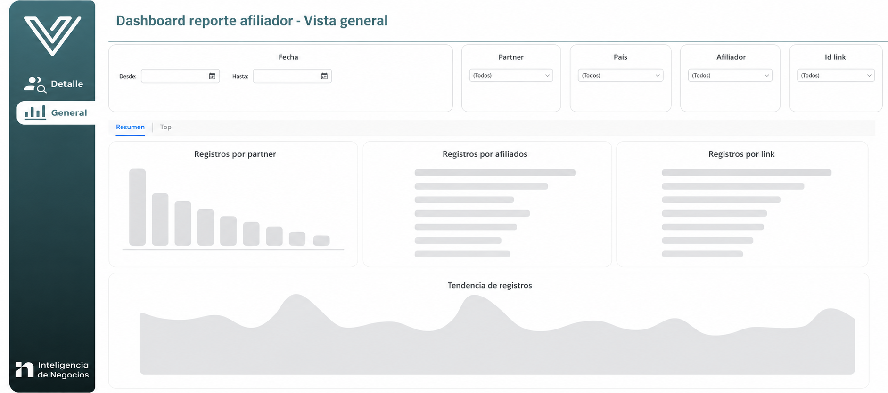

---
layout:
  width: default
  title:
    visible: true
  description:
    visible: false
  tableOfContents:
    visible: true
  outline:
    visible: true
  pagination:
    visible: true
  metadata:
    visible: true
  tags:
    visible: true
  actions:
    visible: true
---

# Dashboard Afiliador

<mark style="color:$info;">Permite consultar la información de los usuarios registrados mediante</mark> [<mark style="color:$info;">afiliados</mark>](https://virtualsoft.gitbook.io/plantillas/glosario?fallback=true#afiliador) <mark style="color:$info;">y enlaces de registro, utilizando diferentes filtros que facilitan la búsqueda, segmentación y análisis de los datos disponibles.</mark>

### 1. Acceso al Módulo

**Ruta de Acceso**: Virtualsoft > Informes compartidos > Datas TI > Paneles Visuales > Dashboard afiliador

***

### 2. Configuraciones&#x20;

En la parte superior izquierda se encuentra el ícono  . Al seleccionarlo, se despliega la sección de configuración que permite definir el rango de fechas y aplicar filtros por afiliador o link de registro para segmentar la información visualizada en el reporte.

<table><thead><tr><th width="183">Campo</th><th>Descripción</th></tr></thead><tbody><tr><td><strong><code>Fecha calendario</code></strong></td><td>Selecciona el rango de fechas sobre el cual se desea consultar la información del reporte. Se debe indicar una fecha inicial y una fecha final.</td></tr><tr><td><strong><code>Explorar valores</code></strong></td><td>Muestra los valores disponibles para el filtro seleccionado, facilitando la búsqueda y selección de la información a consultar.</td></tr><tr><td><strong><code>Afiliador</code></strong></td><td>Permite filtrar la información por uno o varios afiliadores específicos. Para consultar varios afiliadores, ingrese sus identificadores separados por comas (,). Si deja el campo vacío, se mostrarán los datos de todos los afiliadores.</td></tr><tr><td><strong><code>Link registro</code></strong></td><td>FIltra los resultados por uno o varios links de registro. Puede ingresar varios identificadores separados por comas (,). Si no se especifica ningún valor, se incluirán todos los links disponibles.</td></tr><tr><td><strong><code>Guardar selección como nueva respuesta después de ejecutar</code></strong></td><td>Permite conservar los valores seleccionados para utilizarlos nuevamente en futuras consultas del reporte.</td></tr><tr><td><strong><code>Cancelar</code></strong></td><td>Cierra la ventana de filtros sin aplicar los cambios realizados, conservando la configuración previamente utilizada en el reporte.</td></tr><tr><td><strong><code>Aplicar</code></strong></td><td>Ejecuta la consulta utilizando los filtros configurados y actualiza la información presentada en el dashboard de acuerdo con los criterios seleccionados.</td></tr></tbody></table>

### 3. Acciones disponibles

<table><thead><tr><th width="192">Acción</th><th>Descripción</th></tr></thead><tbody><tr><td><a href="dashboard-afiliador.md#id-4.-filtros"><strong>Filtros</strong></a></td><td>Permite definir los criterios de búsqueda para consultar la información de afiliados, partners y enlaces de registro.</td></tr><tr><td><a href="dashboard-afiliador.md#id-5.-vistas-del-dashboard"><strong>Consultar</strong></a></td><td>Actualiza los indicadores y el detalle de resultados de acuerdo con los filtros seleccionados.</td></tr><tr><td><strong>Exportar</strong></td><td>En cada <a href="https://sites.gitbook.com/preview/site_E7EPL/glosario/~/changes/141#card">card</a>, al seleccionar el menú de los ⋮ <em>(3 puntos)</em>, se visualizará la opción de exportación <em>(PDF o Excel)</em>.</td></tr></tbody></table>

### 4. Filtros

<table><thead><tr><th width="137">Campo</th><th width="126">Tipo</th><th>Descripción</th></tr></thead><tbody><tr><td><strong><code>Desde</code></strong></td><td>Fecha</td><td>Fecha inicial del rango de consulta.</td></tr><tr><td><strong><code>Hasta</code></strong></td><td>Fecha</td><td>Fecha final del rango de consulta.</td></tr><tr><td><strong><code>Partner</code></strong></td><td>Lista desplegable</td><td>Filtra la información según el partner asociado.</td></tr><tr><td><strong><code>País</code></strong></td><td>Lista desplegable</td><td>Consulta la información correspondiente a un país específico.</td></tr><tr><td><strong><code>Afiliador</code></strong></td><td>Lista desplegable</td><td>Filtra los resultados por afiliador.</td></tr><tr><td><strong><code>Id Link</code></strong></td><td>Lista desplegable</td><td>Consulta la información asociada a un enlace de registro específico.</td></tr></tbody></table>

### 5. Vistas Del Dashboard

Este tablero cuenta con dos vistas de consulta las cuales son:


**Nota:** Para cambiar entre las vistas **Detalle** y **General**, se debe utilizar el menú ubicado en la barra lateral izquierda del tablero, seleccionando la opción correspondiente a la vista que se desea consultar.




Esta vista muestra información consolidada y detallada sobre los registros realizados a través de afiliados y enlaces de registro.

#### 5.1.1  Visualizacion&#x20;

<figure><figcaption>
Figura #1: Captura de pantalla Dashboard afiliador.
</figcaption></figure>

#### 5.1.2. Kpi´s

La consulta presenta indicadores generales y el detalle de registros asociados a los afiliados y enlaces de registro durante el período seleccionado.

<table><thead><tr><th width="203">Campo</th><th>Descripción</th></tr></thead><tbody><tr><td><strong><code>Cantidad usuarios registrados</code></strong></td><td>Total de usuarios registrados mediante enlaces de afiliación dentro del rango de fechas consultado.</td></tr><tr><td><strong><code>Cantidad de primeros depósitos</code></strong></td><td>Total de usuarios que realizaron su primer depósito <em>(FTD)</em> durante el período consultado.</td></tr><tr><td><strong><code>% FTD</code></strong></td><td>Porcentaje de conversión obtenido entre usuarios registrados y usuarios que realizaron su primer depósito.</td></tr></tbody></table>

***

#### 5.1.3. Tabla de resultados

<table><thead><tr><th width="203">Campo</th><th>Descripción</th></tr></thead><tbody><tr><td><strong><code>Fecha</code></strong></td><td>Fecha en la que se realizó la afiliación del usuario</td></tr><tr><td><strong><code>Afiliador DESC</code></strong></td><td>Nombre descriptivo del afiliador.</td></tr><tr><td><strong><code>Afiliador ID</code></strong></td><td>Identificador único del afiliador.</td></tr><tr><td><strong><code>Link Registro DESC</code></strong></td><td>Nombre descriptivo del enlace de registro asociado.</td></tr><tr><td><strong><code>Link Registro ID</code></strong></td><td>Identificador único del enlace de registro.</td></tr><tr><td><strong><code>Cantidad Usuario Registro</code></strong></td><td>Cantidad de usuarios registrados mediante el enlace correspondiente.</td></tr><tr><td><strong><code>Cantidad Primer Depósito</code></strong></td><td>Cantidad de usuarios que realizaron su primer depósito asociado al enlace consultado.</td></tr><tr><td><strong><code>%FTD</code></strong></td><td>Porcentaje de conversión entre usuarios registrados y primeros depósitos.</td></tr></tbody></table>


**Nota:**\
La columna **%FTD** utiliza una escala de colores para facilitar la identificación del nivel de conversión obtenido por cada afiliador o enlace de registro.


<table><thead><tr><th width="120">Color</th><th width="180">Rango de conversión</th><th>Interpretación</th></tr></thead><tbody><tr><td>🔴 <strong>Rojo</strong></td><td><strong>Menor a 10,99%</strong></td><td>Conversión baja. Indica una baja proporción de usuarios que realizaron su primer depósito respecto al total de registros generados.</td></tr><tr><td><strong>🟠 Naranja</strong></td><td><strong>Entre 11% y 25%</strong></td><td>Conversión media baja. Refleja un nivel inicial de efectividad en la conversión de registros a primeros depósitos.</td></tr><tr><td><strong>🟡 Amarillo</strong></td><td><strong>Entre 26% y 60%</strong></td><td>Conversión media. Indica un desempeño aceptable en la captación y conversión de usuarios registrados.</td></tr><tr><td><strong>🟢 Verde claro</strong></td><td><strong>Entre 61% y 85%</strong></td><td>Conversión alta. Representa una buena efectividad en la transformación de registros en primeros depósitos.</td></tr><tr><td><strong>🟢 Verde oscuro</strong></td><td><strong>Mayor a 85,99%</strong></td><td>Conversión sobresaliente. Evidencia un excelente rendimiento del afiliador o enlace de registro en la conversión de usuarios.</td></tr></tbody></table>



Esta sección se divide en dos vistas de análisis, cada una diseñada para presentar la información desde una perspectiva diferente:



Permite visualizar diferentes gráficos que facilitan el análisis de la cantidad de usuarios registrados según los filtros seleccionados.

#### 5.2.1.1 Visualizacion:

<figure><figcaption>
Figura #2. Captura de pantalla del Dashboard Afiliador, vista general – sección Registros.
</figcaption></figure>

<table><thead><tr><th width="220">Componente</th><th>Descripción</th></tr></thead><tbody><tr><td><strong><code>Registros por partner</code></strong></td><td>Muestra la cantidad de usuarios registrados agrupados por partner, permitiendo identificar cuáles generan el mayor volumen de registros durante el período consultado.</td></tr><tr><td><strong><code>Registros por afiliados</code></strong></td><td>Presenta el ranking de afiliadores con mayor cantidad de registros generados, facilitando la identificación de los afiliadores con mejor desempeño.</td></tr><tr><td><strong><code>Registros por link</code></strong></td><td>Permite visualizar los enlaces de registro con mayor volumen de usuarios captados, facilitando el análisis del rendimiento de cada enlace.</td></tr><tr><td><strong><code>Tendencia de registros</code></strong></td><td>Muestra el comportamiento diario de los registros generados durante el rango de fechas seleccionado, permitiendo identificar tendencias, incrementos o disminuciones en la captación de usuarios.</td></tr></tbody></table>



Permite visualizar diferentes gráficos relacionados con los **Primeros Depósitos&#x20;**_**(First Time Deposit)**_ generados durante el período consultado.

#### 5.2.2.1 Visualizacion:

<figure><figcaption>
Figura #3. Captura de pantalla del Dashboard Afiliador, vista general – sección FTD.
</figcaption></figure>

<table><thead><tr><th width="141">Componente</th><th>Descripción</th></tr></thead><tbody><tr><td><strong><code>Top 5 partner con menos FTD</code></strong></td><td>Muestra los cinco partners con el menor porcentaje de conversión a Primer Depósito <em>(FTD)</em> durante el período consultado, permitiendo identificar oportunidades de mejora en la efectividad de conversión de usuarios registrados a depositantes.</td></tr><tr><td><strong><code>FTD por afiliador</code></strong></td><td>Presenta la cantidad de Primeros Depósitos <em>(FTD)</em> generados por cada afiliador, facilitando la identificación de los afiliadores con mayor volumen de conversiones durante el período seleccionado.</td></tr><tr><td><strong><code>FTD por link</code></strong></td><td>Muestra la cantidad de Primeros Depósitos <em>(FTD)</em> asociados a cada enlace de registro, permitiendo evaluar el desempeño y efectividad de los diferentes enlaces utilizados para la captación de usuarios.</td></tr><tr><td><strong><code>Tendencia de FTD</code></strong></td><td>Presenta mediante un gráfico de líneas la evolución diaria de los Primeros Depósitos <em>(FTD)</em> generados durante el rango de fechas seleccionado, permitiendo analizar tendencias, variaciones y comportamiento de las conversiones a lo largo del tiempo.</td></tr></tbody></table>





***

### 6. Validaciones y reglas del negocio

* El porcentaje FTD se calcula a partir de la relación entre la cantidad de usuarios registrados y la cantidad de primeros depósitos realizados.
* Los resultados mostrados corresponden exclusivamente al rango de fechas seleccionado.
* Los filtros pueden combinarse para obtener consultas más específicas.
* Los indicadores se actualizan automáticamente de acuerdo con los filtros aplicados.
* Este reporte está disponible únicamente para usuarios que cuentan con los permisos de acceso correspondientes. En caso de no visualizar el reporte o no tener acceso a la información, se debe validar la asignación de permisos con el área de Soporte.

***

### 7. Control de Versiones

🔽 Historial de versiones

<table><thead><tr><th width="108">Versión</th><th width="132">Fecha</th><th width="171">Autor</th><th>Cambios Realizados</th></tr></thead><tbody><tr><td>1.0</td><td>22/05/2026</td><td>Karol Juliana Navia</td><td>Creación inicial del manual</td></tr></tbody></table>

