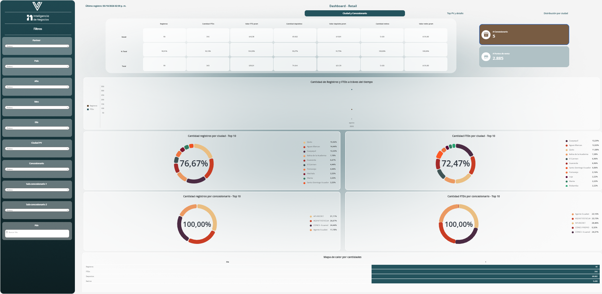

---
layout:
  width: default
  title:
    visible: true
  description:
    visible: false
  tableOfContents:
    visible: true
  outline:
    visible: true
  pagination:
    visible: true
  metadata:
    visible: true
  tags:
    visible: true
  actions:
    visible: true
  anchors:
    visible: true
---

# Dashboard - Retail

<mark style="color:$info;">Ofrece una vista analítica del desempeño de la red de puntos de venta físicos de cada partner por país. Permite medir y dar seguimiento a los principales KPIs, analizando la información por partner, país y estructura territorial para apoyar la toma de decisiones sobre la gestión de la red.</mark>

### 1. Acceso al Módulo

**Ruta de acceso**: Virtualsoft > Informes compartidos > Datas TI > Paneles Visuales > Dashboard - Retail.

***

### 2. Configuraciones previas

Antes de ingresar a este tablero, es necesario completar los filtros que se visualizarán durante las [configuraciones previas](https://virtualsoft.gitbook.io/manuales/microstrategy/library/explorar-carpetas/configuracion-de-tableros#id-1.-configuraciones-previas).

***

### 3. Acciones disponibles

<table><thead><tr><th width="175.92572021484375">Acción</th><th>Descripción</th></tr></thead><tbody><tr><td><strong>Aplicar filtros</strong></td><td>Utiliza los filtros visualizados en las configuraciones previas para realizar la consulta directa antes de ingresar al tablero.</td></tr><tr><td><strong>Visualizar contenido del tablero</strong></td><td>Visualiza el contenido del tablero, el cual está compuesto por tablas y separado por verticales.</td></tr><tr><td><strong>Exportar contenido</strong></td><td>El tablero permite exportar su contenido. Para más información, consulte la guía de exportación <a data-mention href="./#id-3.-exportar-contenido">#id-3.-exportar-contenido</a>.</td></tr></tbody></table>

***

### 4. Filtros

<table><thead><tr><th width="142">Filtro</th><th width="123">Tipo de control</th><th>Descripción</th></tr></thead><tbody><tr><td><strong><code>Partner</code></strong></td><td>Lista desplegable</td><td>Partner al cual está asociado el punto de venta.</td></tr><tr><td><strong><code>País</code></strong></td><td>Lista desplegable</td><td>País en el cuál se encuentra el punto de venta.</td></tr><tr><td><strong><code>Año</code></strong></td><td>Lista desplegable</td><td>Año en el cuál se realizaron los retiros de los puntos de venta.</td></tr><tr><td><strong><code>Mes</code></strong></td><td>Lista desplegable</td><td>Mes el cuál se realizaron los retiros en los puntos de venta.</td></tr><tr><td><strong><code>Día</code></strong></td><td>Lista desplegable</td><td>Día el el cuál se realizaron los retiros en los puntos de venta.</td></tr><tr><td><strong><code>Ciudad PV</code></strong></td><td>Lista desplegable</td><td>Ciudad en la cual se encuentra el punto de venta.</td></tr><tr><td><strong><code>Concesionario</code></strong></td><td>Lista desplegable</td><td>Nombre del concesionario.</td></tr><tr><td><strong><code>Sub-concesionario 1</code></strong></td><td>Lista desplegable</td><td>Filtra por el identificador único del sub concesionario 1</td></tr><tr><td><strong><code>Sub- concecionario 2</code></strong></td><td>Lista desplegable</td><td>Filtra por el identificador único del sub concesionario 2</td></tr><tr><td><strong><code>PDV</code></strong></td><td>Lista desplegable</td><td>Filtra por el nombre del punto de venta.</td></tr></tbody></table>

***

### 4. KPIs

El dashboard presenta indicadores generales de la red de puntos de venta según los filtros aplicados.

| KPI                     | Descripción                                                    |
| ----------------------- | -------------------------------------------------------------- |
| **`# Concesionario`**   | Número de concesionarios activos según los filtros aplicados.  |
| **`# Puntos de venta`** | Número de puntos de venta activos según los filtros aplicados. |

#### **4.1. Indicadores de actividad**

Los indicadores de actividad se presentan mediante una tabla de lectura vertical. Para cada indicador, la fila **`Retail`** muestra el resultado correspondiente a la operación Retail, la fila **`% Total`** muestra el porcentaje de participación de dicho resultado respecto al **`Total`**, y la fila **`Total`** presenta el resultado consolidado.


**Ejemplo:** En el indicador **`Registros`**, se muestran **90 registros** para Retail, que representan el **90,91 %** del total de **99 registros**.


<table><thead><tr><th width="215">Indicador</th><th>Descripción</th></tr></thead><tbody><tr><td><strong><code>Registros</code></strong></td><td>Cantidad de registros obtenidos según los filtros aplicados.</td></tr><tr><td><strong><code>Cantidad FTDs</code></strong></td><td>Cantidad de usuarios que realizaron su primer depósito (FTD).</td></tr><tr><td><strong><code>Valor FTD prom</code></strong></td><td>Valor promedio de los primeros depósitos (FTD).</td></tr><tr><td><strong><code>Cantidad depósitos</code></strong></td><td>Cantidad de depósitos realizados en los puntos de venta.</td></tr><tr><td><strong><code>Valor depósito prom</code></strong></td><td>Valor promedio de los depósitos realizados en los puntos de venta.</td></tr><tr><td><strong><code>Cantidad retiros</code></strong></td><td>Cantidad de retiros realizados en los puntos de venta.</td></tr><tr><td><strong><code>Valor retiro prom</code></strong></td><td>Valor promedio de los retiros realizados en los puntos de venta.</td></tr></tbody></table>

***

### 5. Contenido del dashboard.

El dasboard se compone de 3 pestañas las cuales segmentan la información consultada _(ciudad y concesionario, top PV y detalle, Distribución por ciudad)_.



Visualiza información sobre el comportamiento de los concecionarios según la ciudad.

#### Visualización

<figure><figcaption>
Figura #1: Captura de pantalla pestaña ciudad y concesionario.
</figcaption></figure>

<table><thead><tr><th width="112">Gráfico</th><th width="162">Tipo de gráfico</th><th>Descripción</th></tr></thead><tbody><tr><td><strong><code>Cantidad de registros y FTDs a tráves del tiempo</code></strong></td><td>Líneal</td><td></td></tr><tr><td><strong><code>Cantidad registros por ciudad - top 10</code></strong></td><td>Torta</td><td></td></tr><tr><td><strong><code>Cantidad FTDs por ciudad - top 10</code></strong></td><td>Torta</td><td></td></tr><tr><td><strong><code>Cantidad registros por concecionario - top 10</code></strong></td><td>Torta</td><td></td></tr><tr><td><strong><code>Cantidad FTDs por concesionario - top 10</code></strong></td><td>Torta</td><td></td></tr></tbody></table>

* Tabla Mapa de calor por cantidades

La tabla presenta las columnas día y 1. las filas corresponden a la información

<table><thead><tr><th width="230">Fila</th><th>Descripción</th></tr></thead><tbody><tr><td><strong><code>Registros</code></strong></td><td>Cantidad de retiros realizados en ese día</td></tr><tr><td><strong><code>FTDs</code></strong></td><td>Cantidad de </td></tr><tr><td><strong><code>Depósitos</code></strong></td><td></td></tr><tr><td><strong><code>Retiros</code></strong></td><td></td></tr></tbody></table>



(descripción)&#x20;

Visualización

<figure><figcaption>
Figura #1: Captura de pantalla pestaña Top PV y detalle.
</figcaption></figure>

<table><thead><tr><th width="171">Gráfico</th><th>Tipo de gráfico</th><th>Descripción</th></tr></thead><tbody><tr><td>Top 10 PV - valor depósitos</td><td>Barras</td><td></td></tr><tr><td>Top 10 PV - Valor retiros</td><td>Barras</td><td></td></tr><tr><td>Top 10 pv - Cantidad registros</td><td>Barras</td><td></td></tr><tr><td>Top 10 PV - Valor FTDs</td><td>Barras</td><td></td></tr></tbody></table>

* Tabla detalle

Esta tabla contiene información más a detalle&#x20;

<table><thead><tr><th width="210">Columna</th><th>Descripción</th></tr></thead><tbody><tr><td><strong><code>ID PDV</code></strong></td><td>Identificador único del punto de venta</td></tr><tr><td><strong><code>Nombre PDV</code></strong></td><td></td></tr><tr><td><strong><code>Id concesionario</code></strong></td><td></td></tr><tr><td><strong><code>Nombre concesionario</code></strong></td><td></td></tr><tr><td><strong><code>Ciudad pdv</code></strong></td><td>Ciudad donde se encuentra el punto de venta</td></tr><tr><td><strong><code>Cantidad depósitos</code></strong></td><td></td></tr><tr><td><strong><code>Valor total depósitos</code></strong></td><td></td></tr><tr><td><strong><code>Depósitos promedio</code></strong></td><td></td></tr><tr><td><strong><code>Cantidad retiros</code></strong></td><td></td></tr><tr><td><strong><code>Valor total retiros</code></strong></td><td></td></tr><tr><td><strong><code>Retiro promedio</code></strong></td><td></td></tr><tr><td><strong><code>Registros</code></strong> </td><td></td></tr><tr><td><strong><code>FTD</code></strong></td><td></td></tr><tr><td><strong><code>Valor FTD promedio</code></strong></td><td></td></tr></tbody></table>




(descripción)&#x20;

Visualización

<figure><figcaption></figcaption></figure>

| Gráfico                                                        | Tipo de gráfico | Descripción |
| -------------------------------------------------------------- | --------------- | ----------- |
| **`Relación entre cantidad y valor de depósitos por ciudad`**  | Lineal          |             |
| **`Relación entre cantidad y valor de retiros por ciudad`**    | lineal          |             |
| **`Relación entre cantidad registros y valor FTD por ciudad`** | lineal          |             |
| **`Relación entre cantidad y valor FTDs por ciudad.`**         | Lineal          |             |



***

### 6. Control de Versiones

🔽 Historial de versiones

<table><thead><tr><th width="94.7037353515625">Versión</th><th width="133.25927734375">Fecha</th><th width="161.77777099609375">Autor</th><th>Cambios Realizados</th></tr></thead><tbody><tr><td>1.0</td><td>05/10/2026</td><td>Ronald Pelaéz</td><td>Documento inicial</td></tr></tbody></table>

