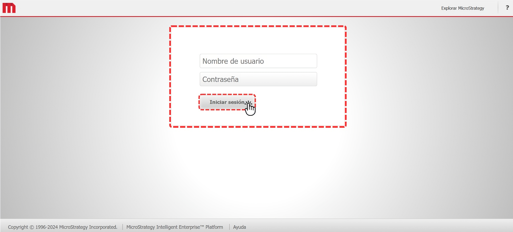

# ¿Cómo acceder?

Para acceder a la herramienta, haz clic en el siguiente enlace.

> [https://reporting.virtualsoft.tech/MicroStrategy/servlet/mstrWeb](https://reporting.virtualsoft.tech/MicroStrategy/servlet/mstrWeb)

Al acceder al enlace, completa los campos de usuario y contraseña en el formulario. Luego, haz clic en "**Iniciar sesión**" para ingresar a tu cuenta.

<figure><figcaption>
Figura #1: Captura de pantalla de la sección inicio MicroStrategy.
</figcaption></figure>

Una vez dentro de tu cuenta, verás los proyectos asociados. Haz clic en "VirtualSoft" para acceder y comenzar a trabajar en él.

<figure><figcaption>
Figura #2: Captura de pantalla de la sección Proyectos.
</figcaption></figure>

Al ingresar al proyecto, verás la pantalla de inicio con una vista general de la herramienta de la siguiente manera:

<figure><figcaption>
Figura #3: Captura de pantalla de la sección inicio.
</figcaption></figure>

Estas son las opciones disponibles que nos brinda la herramienta, para más información puedes dar clic en la página correspondiente.


[configuracion-perfil..md](configuracion-perfil..md)



[modulo-de-reporte.](modulo-de-reporte./)

