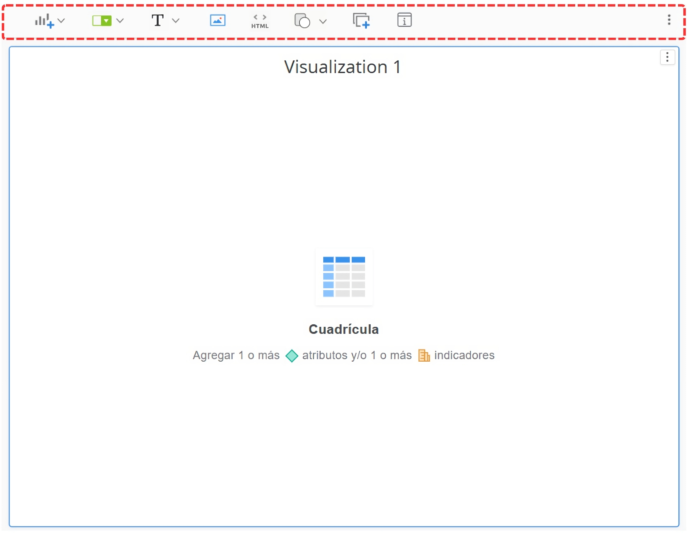

# Dashboard (Tableros)

Es una herramienta diseñada para mostrar la información clave de manera resumida y visual, orientadas principalmente hacia un enfoque gerencial y de toma de decisiones. Aquí, la información es presentada de forma gráfica y general, no tan detallada, permitiendo obtener una visión clara y rápida de los datos más relevantes para facilitar su interpretación y análisis estratégico.

<figure><figcaption>
Figura #1: Captura de pantalla del campo Nuevo dasboard.
</figcaption></figure>

Esta es la visual inicial del Dashboard, aquí podrás identificar tres paneles los cuales son: Contenido, Conjunto de datos y Editor, adicional a esto, contamos con la sección de visualización, en la cuál se verá reflejada la solicitud que le realices a la base de datos.&#x20;

<figure><figcaption>
Figura #2: Captura de pantalla de la sección Dashboard.
</figcaption></figure>

A continuación, encontrarás una descripción detallada de cada uno de los paneles mencionados anteriormente, explicados de forma individual.

* **Contenido**: Este panel está diseñado para agregar capítulos o páginas dentro de un mismo tablero. La jerarquía establece que los capítulos pueden contener una o más páginas, y tanto los capítulos como las páginas funcionan de manera totalmente independiente entre sí. Esto permite una organización estructurada y flexible del contenido dentro del tablero.

<figure><figcaption>
Figura #3: Captura de pantalla del panel Contenido de la sección Dashboard.
</figcaption></figure>

*   **Conjunto de datos**: Este panel te permite importar información, ya sea desde fuentes externas o utilizando los objetos (atributos) que ya han sido establecidos previamente en la herramienta. De esta manera, podrás integrar y trabajar con los datos que necesitas para el análisis y la creación de reportes o Dashboard.

    * **Datos nuevos:** Al dar clic en el botón "Datos Nuevos", se desplegará una lista de aplicaciones disponibles, con las cuales puedes seleccionar para extraer datos externos de proveedores terceros.

    <figure><figcaption>
Figura #4. Captura de pantalla del campo Terceros de la sección Dashboard.
</figcaption></figure>

    * **Datos Existentes:** Al dar clic en el botón "Datos Existentes", se desplegará una lista de carpetas y opciones para agregar datos al Dashboard desde la información que ya tenemos generada en nuestra base de datos.

    <figure><figcaption>
Figura #5: Captura de pantalla del campo datos existentes de la sección Dashboard.
</figcaption></figure>

    * **Objetos Existentes:** Al dar clic en el botón "Objetos existentes" podrás agregar información a la Dashboard en base a diferentes parámetros, los cuales pueden ser:
    * **Atributos:** Son columnas de tipo texto en la base de datos, utilizadas para describir características cualitativas de los datos.
    * **Indicadores:** Son columnas de tipo numérico (valores) en la base de datos, utilizadas para representar métricas o valores cuantitativos de los datos.

    <figure><figcaption>
Figura #6: Captura de pantalla del campo Agregar objetos existentes de la sección Dashboard
</figcaption></figure>


**Nota:** Los parámetros "**Objetos Públicos**" y "**Mis Objetos Personales**" son configuraciones predeterminadas de la herramienta; sin embargo, actualmente no están en uso.


* **Editor:** Desde este panel, podrás personalizar los elementos visuales, como gráficos, tablas, filtros, tarjetas y otros componentes. Esto te permite adaptar la apariencia y el formato de cada objeto visual para que se ajuste a las necesidades de tu análisis y facilite la interpretación de los datos.

<figure><figcaption>
Figura #7: Captura de pantalla del campo Editor de la sección Dashboard.
</figcaption></figure>

* **Filtro**: Desde este panel, podrás seleccionar y aplicar filtros para visualizar solo la información relevante en el Dashboard, ajustando los datos según tus necesidades de análisis.

<figure><figcaption>
Figura #8: Captura de pantalla del campo Filtro de la sección Dashboard.
</figcaption></figure>


**Nota**: Se recomienda aplicar la mayor cantidad de filtros posible, ya que no existe un límite en su uso. Cuantos más filtros apliques, más precisa será la información obtenida, lo que facilita un análisis detallado sin sobrecargar la base de datos.


* **Formato**: Desde este panel, podrás personalizar el estilo de presentación de la información en el Dashboard, ajustando aspectos como el tipo de letra, los colores, los contenedores y otros elementos de formato para mejorar la visualización y el impacto de los datos.

<figure><figcaption>
Figura #9: Captura de pantalla del campo Formato de la sección Dashboard.
</figcaption></figure>

Desde esta sección, podrás visualizar la información agregada, ajustada según los filtros aplicados anteriormente. Además, en estos objetos visuales, tendrás acceso a módulos que te permitirán insertar más objetos, aplicar filtros específicos, agregar imágenes y convertir el lienzo a modo libre, lo que te brindará la flexibilidad de añadir y ajustar objetos según el tamaño que desees, adaptando el Dashboard a tus necesidades.

<figure><figcaption>
Figura # 10: Captura de pantalla de la sección Dashboard.
</figcaption></figure>
