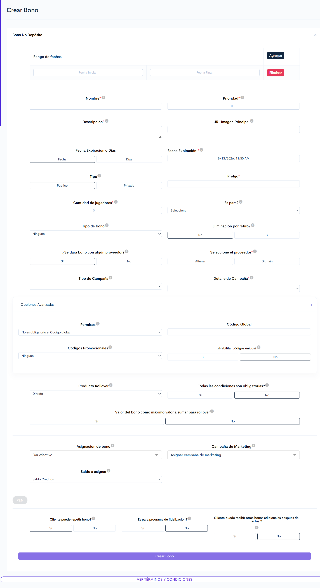

# Bono no Depósito.

<mark style="color:$info;">Crea un bono que se entrega al usuario sin necesidad de que realice un depósito previo. El bono puede asignarse directamente a usuarios específicos o entregarse mediante códigos únicos, y puede configurarse con o sin rollover según se requiera que el usuario apueste para liberarlo.</mark>

### 1. Acceso al Módulo

**Ruta de Acceso**: BackOffice > Torneos y Bonos > País > Bonos > Bono No Depósito

***

### 2. Visualización

<figure><figcaption>
Figura #1: Captura de pantalla creación de Bono No Depósito.
</figcaption></figure>

***

### 3. ¿Cómo funciona este bono?

Se otorga al usuario sin requerir un depósito previo. Su funcionamiento se define mediante dos configuraciones:

* **Forma de entrega:** mediante asignación directa por archivo CSV o mediante códigos únicos.
* **Rollover:** puede estar disponible de inmediato o requerir que el usuario realice apuestas para liberarlo.

#### 3.1. Conceptos clave


**Nota:** Comprender estos conceptos es fundamental para configurar correctamente el bono, ya que cada uno determina cómo se entrega el saldo al usuario, qué debe cumplir para liberarlo y en qué momento se convierte en saldo real.


<table><thead><tr><th width="144.1666259765625">Concepto</th><th>Descripción</th></tr></thead><tbody><tr><td><strong>Saldo bono</strong></td><td>Saldo que recibe el usuario al obtener el bono. Su disponibilidad depende de si el bono requiere rollover.</td></tr><tr><td><strong>Rollover</strong></td><td>
Monto total que el usuario debe apostar para liberar el bono. Se calcula multiplicando el valor del bono por el factor de rollover configurado, y contabiliza el dinero apostado, no las ganancias obtenidas.

<strong>Fórmula:</strong> <em>Rollover = Valor del bono × Factor rollover de Bono</em>
</td></tr><tr><td><strong>Apuesta válida</strong></td><td>Apuesta que cumple las condiciones configuradas <em>(producto, cuotas, selecciones y eventos habilitados)</em>. Únicamente estas apuestas descuentan del rollover pendiente.</td></tr><tr><td><strong>Saldo real</strong></td><td>Saldo disponible del usuario, el cual puede retirar o utilizar libremente.</td></tr></tbody></table>

#### 3.2. Entrega y liberación del bono

**Formas de entrega**


**Escenarios posibles:** ambas configuraciones son independientes, por lo que el bono puede entregarse por CSV o por códigos únicos, y en cualquiera de los dos casos quedar disponible de inmediato _(sin rollover)_ o requerir que el usuario complete el rollover con apuestas válidas para liberar el saldo.


<table><thead><tr><th width="145.83331298828125">Forma de entrega</th><th>Descripción</th></tr></thead><tbody><tr><td><strong>Asignación directa</strong> <em>(archivo CSV)</em></td><td>El bono se asigna automáticamente a los usuarios incluidos en el archivo CSV cargado en el campo <strong><code>Jugadores</code></strong>, sin que estos realicen ninguna acción adicional.</td></tr><tr><td><strong>Códigos únicos</strong></td><td>El sistema genera un código único por cada usuario definido en el campo <strong><code>Cantidad de jugadores</code></strong>. El usuario <a href="https://virtualsoft.gitbook.io/plantillas/glosario?select=asociar-franquicia,gesti%C3%B3n-de-franquicias,estados,configuraci%C3%B3n-visual,3.1.-juegos,3.2.-historial-de-cargas#redimir">redime</a> el bono ingresando su código en la sección <strong>Mis bonos</strong> de la plataforma de usuarios online. Por ejemplo, con el valor <strong>5</strong> se generan <strong>5 códigos únicos</strong>, uno por usuario.</td></tr></tbody></table>


**Nota importante:** Para entregar el bono mediante códigos únicos es obligatorio habilitar el campo [**`¿Habilitar códigos únicos?`**](./#id-5.1.-opciones-avanzadas) en las opciones avanzadas. De lo contrario, los códigos generados no funcionarán y los usuarios no podrán redimir el bono.


**Liberación del saldo**

El campo **`Producto Rollover`** determina si el bono tendrá **rollover**, es decir, si el usuario deberá realizar apuestas para liberarlo.

<table><thead><tr><th width="160.8333740234375">Configuración</th><th>Funcionamiento</th></tr></thead><tbody><tr><td><strong>Sin rollover</strong> <em>(opción Directo)</em></td><td>El saldo del bono queda disponible para el usuario de inmediato, sin necesidad de realizar apuestas.</td></tr><tr><td><strong>Con rollover</strong> <em>(Casino, Live Casino, Virtual o Sportsbook)</em></td><td>El usuario recibe el saldo como saldo bono y debe apostarlo en el producto configurado hasta completar el rollover. Al completarlo, el saldo bono restante se convierte en saldo real; si el usuario agota el saldo antes de cumplirlo o el bono expira, el saldo se pierde.</td></tr></tbody></table>


**Ejemplo:** Un bono de **$10** con un factor de rollover de **5** genera un rollover de **$50**.

**Al recibir el bono:** el usuario cuenta con $10 de saldo bono y le faltan $50 por apostar.

**Apuesta sus $10 y gana.** Como apostó $10, ahora le faltan $40 por apostar. Su saldo bono sube a $25 gracias a la ganancia.

**Apuesta esos $25 y vuelve a ganar.** Le faltan $15 por apostar y su saldo bono sube a $35.

**Apuesta $20.** Con esta apuesta supera los $15 que le faltaban, por lo que el rollover queda **cumplido**. Su saldo bono restante es de $15.

**Resultado:** aunque esa última apuesta resulte perdedora, el rollover ya está completo. Los $15 de saldo bono restantes se acreditan como saldo real.


***

### 4. Acciones disponibles en el módulo

<table><thead><tr><th width="200.3333740234375">Acción</th><th>Descripción</th></tr></thead><tbody><tr><td><a href="./#id-5.-configuraciones-del-bono"><strong>Configurar bono no depósito</strong></a></td><td>
Permite configurar un bono de tipo no depósito mediante el formulario disponible en este módulo.

<strong>Nota</strong>: Los campos cuyo nombre finaliza con un asterisco (<mark style="color:$danger;">*</mark>) son obligatorios para la creación del bono.

</td></tr><tr><td><strong>Configurar términos y condiciones del bono</strong></td><td>En la parte final del formulario se encuentra el botón <strong>"</strong><em><strong>Ver términos y condiciones</strong></em><strong>"</strong>, el cual despliega un editor de texto donde se ingresan los términos y condiciones aplicables al bono.</td></tr><tr><td><strong>Crear bono</strong></td><td>Envía la información registrada en el formulario y genera el bono en el sistema.</td></tr></tbody></table>

***

### 5. Configuraciones del bono

<table><thead><tr><th width="130.33343505859375">Campo</th><th width="116.33331298828125">Tipo de control</th><th>Descripción</th></tr></thead><tbody><tr><td><strong><code>Rango de fechas</code></strong></td><td>Botón</td><td>
Despliega los campos de fecha que definen el período de vigencia del bono.

<strong>Nota</strong>: Es posible configurar múltiples rangos de fechas mediante el botón <strong>"</strong><em><strong>Agregar</strong></em><strong>"</strong>, una vez establecidas la <strong>fecha inicial</strong> y la <strong>fecha final</strong> de cada rango.

</td></tr><tr><td><strong><code>Nombre</code></strong></td><td>Texto</td><td>Nombre que identifica el bono en la plataforma.</td></tr><tr><td><strong><code>Prioridad</code></strong></td><td>Numérico</td><td>
Define el orden de asignación de bonos a los usuarios. Un número mayor indica mayor prioridad.

<strong>Ejemplo:</strong> Con tres bonos configurados así:
<ul><li><strong>Bono A:</strong> 1</li><li><strong>Bono B:</strong> 2</li><li><strong>Bono C:</strong> 3</li></ul>
El sistema da preferencia al <strong>Bono C</strong>, por tener la prioridad más alta.

</td></tr><tr><td><strong><code>Descripción</code></strong></td><td>Texto</td><td>Detalles adicionales del bono que se visualizan en la plataforma de usuarios online.</td></tr><tr><td><strong><code>URL Imagen principal</code></strong></td><td>Texto</td><td>Enlace de la imagen que se muestra al usuario al visualizar el bono.</td></tr><tr><td><strong><code>Fecha de expiración</code></strong></td><td>Selector de fecha</td><td>
Define el plazo para <a href="https://virtualsoft.gitbook.io/plantillas/glosario?select=asociar-franquicia,gesti%C3%B3n-de-franquicias,estados,configuraci%C3%B3n-visual,3.1.-juegos,3.2.-historial-de-cargas#redimir">redimir</a> el bono. Con la opción <strong>"</strong><em><strong>Días</strong></em><strong>"</strong> se ingresa la cantidad de días hasta su vencimiento; con la opción <strong>"</strong><em><strong>Fecha</strong></em><strong>"</strong> se indica la fecha exacta de expiración. Cumplido el plazo, el bono queda inactivo.

<strong>Nota</strong>: Los campos <strong><code>Días</code></strong> y <strong><code>Fecha expiración</code></strong> son dinámicos y se visualizan según la opción seleccionada.

</td></tr><tr><td><strong><code>Tipo</code></strong></td><td>Lista desplegable</td><td>Determina si el bono es público <em>(todos los usuarios)</em> o privado <em>(VIP)</em>.</td></tr><tr><td><strong><code>Prefijo</code></strong></td><td>Texto</td><td>Identificador adicional que diferencia el bono de otros.</td></tr><tr><td><strong><code>Cantidad de jugadores</code></strong></td><td>Numérico</td><td>
Cantidad de usuarios que pueden acceder al bono. Este campo es <strong>obligatorio</strong>.

<strong>Nota:</strong> Cuando el bono se entrega mediante códigos únicos, el sistema genera un código por cada usuario definido en este campo. Por ejemplo, con el valor <strong>5</strong> se generan <strong>5 códigos únicos</strong>.

</td></tr><tr><td><strong><code>¿Es para?</code></strong></td><td>Lista desplegable</td><td>Define la sección o funcionalidad de la plataforma a la que está orientado el bono <em>(por ejemplo: ruleta, sorteo, CRM, landing de registro, fidelización o cashback, bono de cumpleaños, tours, misiones)</em>.</td></tr><tr><td><strong><code>Tipo de bono</code></strong></td><td>Lista desplegable</td><td>Define si el bono se asigna automáticamente al momento del registro del usuario o si no se asigna de forma automática.</td></tr><tr><td><strong><code>¿Eliminación por retiro?</code></strong></td><td>Selector</td><td>Define si el bono se elimina de la cuenta del usuario al generarse una nota de retiro.</td></tr><tr><td><strong><code>¿Se dará bono con algún proveedor?</code></strong></td><td>Selector</td><td>Indica si el bono se otorga a través de un proveedor externo. Al seleccionar <strong>"</strong><em><strong>Sí</strong></em><strong>"</strong>, se habilita el campo <strong><code>Seleccione el proveedor</code></strong>.</td></tr><tr><td><strong><code>Seleccione el proveedor</code></strong></td><td>Selector</td><td>Define el proveedor mediante el cual se entrega el bono. Para la configuración de bonos con <strong>Digitain</strong>, consultar el siguiente manual: <a data-mention href="creacion-bono-no-deposito-para-digitain.md">creacion-bono-no-deposito-para-digitain.md</a></td></tr><tr><td><strong><code>Tipo de campaña</code></strong></td><td>Lista desplegable</td><td>Define el objetivo principal del bono dentro de la estrategia de campaña. Las opciones disponibles son:</td></tr></tbody></table>


{% column width="33.33333333333333%" %}



{% column width="66.66666666666667%" %}
<table><thead><tr><th width="149">Opción</th><th>Descripción</th></tr></thead><tbody><tr><td><strong><code>Adquisición</code></strong></td><td>Bono destinado a atraer nuevos usuarios.</td></tr><tr><td><strong><code>Retención</code></strong></td><td>Bono diseñado para mantener activos a los usuarios actuales.</td></tr><tr><td><strong><code>Reactivación</code></strong></td><td>Bono orientado a recuperar usuarios inactivos.</td></tr><tr><td><strong><code>Retención de saldo</code></strong></td><td>Bono para incentivar el uso del saldo existente y evitar retiros.</td></tr></tbody></table>



***

<table data-header-hidden data-search="false"><thead><tr><th width="122.8333740234375">Campo</th><th width="121.33331298828125">Tipo de control</th><th>Descripción</th></tr></thead><tbody><tr><td><strong><code>Detalle de Campaña</code></strong></td><td>Lista desplegable</td><td>
Define la clasificación específica del bono, facilitando su identificación, trazabilidad y análisis desde la administración de bonos.

Este campo es <strong>obligatorio</strong> y admite una única categoría entre las opciones del sistema <em>(por ejemplo: Bono de registro, Referidos, CRM fidelización)</em>. Si no se selecciona, el sistema muestra un mensaje de error.
</td></tr></tbody></table>

***

<strong>Opciones avanzadas</strong>

Configuraciones complementarias que definen cómo se controla el acceso al bono y su redención mediante códigos.

<table><thead><tr><th width="163.50006103515625">Campo</th><th>Descripción</th></tr></thead><tbody><tr><td><strong><code>Permisos</code></strong></td><td>Define si el código global es obligatorio para acceder al bono.</td></tr><tr><td><strong><code>Código Global</code></strong></td><td>Código configurado en BackOffice que limita la cantidad máxima de usuarios que pueden acceder al bono.</td></tr><tr><td><strong><code>Códigos Promocionales</code></strong></td><td>Código promocional configurado en BackOffice, utilizado para campañas específicas.</td></tr><tr><td><strong><code>¿Habilitar códigos únicos?</code></strong></td><td>
Define si el bono puede redimirse mediante códigos únicos generados automáticamente por el sistema, uno por cada usuario definido en el campo <strong><code>Cantidad de jugadores</code></strong>.

<strong>Nota:</strong> Este campo debe habilitarse obligatoriamente para entregar el bono mediante códigos únicos.

</td></tr></tbody></table>

***

<table data-header-hidden><thead><tr><th width="129.83331298828125">Campo</th><th width="117.33331298828125">Tipo de control</th><th>Descripción</th></tr></thead><tbody><tr><td><strong><code>Producto Rollover</code></strong></td><td>Lista desplegable</td><td>
Define si el bono requiere que el usuario realice apuestas para liberarlo y, en caso de requerirlo, en qué producto deben realizarse. Las opciones disponibles son <strong>Directo</strong>, <strong>Casino</strong>, <strong>Sportsbook</strong>, <strong>Live Casino</strong> y <strong>Virtual</strong>.
<ul><li><strong>Directo:</strong> el bono no requiere rollover; el saldo queda disponible para el usuario sin necesidad de apostar.</li><li><strong>Casino, Live Casino, Virtual y Sportsbook:</strong> el bono requiere rollover y habilita las configuraciones correspondientes al producto seleccionado, las cuales determinan qué apuestas son válidas para liberarlo.</li></ul></td></tr></tbody></table>


{% column width="33.33333333333333%" %}



{% column width="66.66666666666667%" %}

<strong>Configuraciones: Casino, Live Casino y Virtual</strong>

Definen los juegos en los que el usuario debe apostar para que sus apuestas descuenten del rollover.

<table><thead><tr><th width="124.1666259765625">Sección</th><th>Descripción</th></tr></thead><tbody><tr><td><strong><code>Categorías</code></strong></td><td>Define la categoría general sobre la cual aplica la configuración, estableciendo el grupo principal de productos al que aplican las condiciones.</td></tr><tr><td><strong><code>Proveedores</code></strong></td><td>Define uno o varios proveedores asociados a la categoría elegida.</td></tr><tr><td><strong><code>Productos</code></strong></td><td>Define los productos específicos sobre los cuales aplica la configuración. Esta selección depende de la categoría y el proveedor previamente seleccionados.</td></tr></tbody></table>

<strong>Configuraciones: Sportsbook</strong>

Definen las apuestas deportivas que son válidas para descontar del rollover. Las secciones **Deporte, Mercados, Ligas y Partidos** comparten la misma estructura y configuración: los campos y condiciones son los mismos en todas, variando únicamente el nivel al que se aplican _(deporte, mercado, liga o partido)_.

<table data-search="false"><thead><tr><th width="122.66650390625">Campo</th><th width="258.0103759765625">Descripción</th></tr></thead><tbody><tr><td><strong><code>¿Todas las condiciones son obligatorias?</code></strong></td><td>Define si las condiciones configuradas deben cumplirse en su totalidad. Con la opción "<em><strong>Sí</strong></em>", se revisan una a una y todas deben cumplirse para aplicar la regla. Con la opción "<em><strong>No</strong></em>", cada condición se evalúa de forma independiente y basta con que alguna se cumpla.</td></tr><tr><td><strong><code>Deporte, Mercados, Ligas o Partidos</code></strong></td><td>Define los identificadores <em>(ID)</em> de los elementos a los que aplica la configuración <em>(deportes, mercados, ligas o partidos)</em>. Admite múltiples ID separados por comas.</td></tr><tr><td><strong><code>Tipo de apuesta</code></strong></td><td>Define el tipo de apuesta al que aplica la configuración: <strong>Single</strong> <em>(apuesta simple)</em>, <strong>Multiple</strong> <em>(apuesta combinada)</em> o <strong>System</strong> <em>(apuestas de sistema)</em>.</td></tr><tr><td><strong><code>Tipo de evento</code></strong></td><td>Define el tipo de evento al que aplica la configuración: <strong>Both</strong> <em>(pre-match y en vivo)</em>, <strong>Pre-match</strong> <em>(antes del evento)</em> o <strong>Live</strong> <em>(en vivo)</em>.</td></tr><tr><td><strong><code>Mínima cantidad en selecciones</code></strong></td><td>Número mínimo de selecciones que debe tener una apuesta para que aplique la configuración.</td></tr><tr><td><strong><code>Mínima cuota en selecciones</code></strong></td><td>Cuota mínima que debe tener cada selección dentro de la apuesta.</td></tr><tr><td><strong><code>Mínima cuota total</code></strong></td><td>Cuota mínima total que debe cumplir la apuesta.</td></tr><tr><td><strong><code>Repetir Partidos</code></strong></td><td>Define si se permite incluir el mismo partido más de una vez dentro de una apuesta.</td></tr><tr><td><strong><code>Repetir Mercados</code></strong></td><td>Define si se permite incluir el mismo mercado más de una vez dentro de una apuesta.</td></tr></tbody></table>




<table data-header-hidden data-search="false"><thead><tr><th width="134.166748046875">Campo</th><th width="120.5">Tipo de control</th><th>Descripción</th></tr></thead><tbody><tr><td><strong><code>Asignación de bono</code></strong></td><td>Lista desplegable</td><td>Define si se otorga dinero directo o un bono previamente creado.</td></tr><tr><td><strong><code>Todas las condiciones son obligatorias</code></strong></td><td>Botón de selección</td><td>Define si todas las condiciones configuradas previamente deben cumplirse para que la apuesta sea válida y descuente del rollover.</td></tr><tr><td><strong><code>Campaña de marketing</code></strong></td><td>Sección</td><td>Configura las notificaciones que llegan al inbox de la plataforma.</td></tr><tr><td><strong><code>Saldo a asignar</code></strong></td><td>Lista desplegable</td><td>Define el tipo de saldo que recibe el usuario al <a href="https://virtualsoft.gitbook.io/untitled/glosario/?q=redimir#redimir">redimir</a> el bono.</td></tr><tr><td><strong><code>Tipo de máximo monto para rollover</code></strong></td><td>Lista desplegable</td><td>
Define cómo se determina el tope máximo aplicado al cálculo del rollover:
<ul><li><strong>Depende del bono redimido:</strong> el tope se calcula a partir del valor del bono que recibió el usuario.</li><li><strong>No depende del bono redimido:</strong> el tope corresponde a un valor fijo, independiente del monto del bono entregado.</li></ul></td></tr><tr><td><strong><code>Factor rollover de Bono</code></strong></td><td>Numérico</td><td>
Número por el cual se multiplica el valor del bono para determinar el monto total que el usuario debe apostar antes de liberarlo.

<strong>Fórmula:</strong> <em>Rollover = Valor del bono × Factor rollover de Bono</em>

<strong>Ejemplo:</strong> Con un bono de <strong>$10</strong> y un factor de rollover de <strong>5</strong>, el rollover es de <strong>$50</strong>. El usuario debe apostar $50 en total para liberar el bono; hasta alcanzar ese monto, el saldo bono no se convierte en saldo real.

</td></tr><tr><td><strong><code>Valor del bono como máximo valor a sumar para rollover</code></strong></td><td>Botón de selección</td><td>Define si el valor del bono se toma hasta un tope máximo al calcular el monto que el usuario debe apostar, en lugar de considerar su valor total.</td></tr></tbody></table>

***

Moneda

Al dar clic en la moneda correspondiente al país con el que se ingresó a la plataforma, se desplegarán las siguientes configuraciones:

<figure><figcaption>
Figura #2: Captura de pantalla configuración de moneda
</figcaption></figure>

<table><thead><tr><th width="142">Campo</th><th width="119">Tipo de control</th><th>Descripción</th></tr></thead><tbody><tr><td><strong><code>Monto de Bono Fijo</code></strong></td><td>Numérico</td><td>Valor fijo del bono que recibe el usuario.</td></tr><tr><td><strong><code>Máxima apuesta tomada para rollover</code></strong></td><td>Numérico</td><td>
Monto máximo de una apuesta que se contabiliza para el rollover. Si el usuario apuesta un valor superior, el excedente no descuenta del rollover pendiente.

<strong>Ejemplo:</strong> Con una máxima apuesta de <strong>$20</strong>, si el usuario realiza una apuesta de <strong>$50</strong>, solo se descuentan <strong>$20</strong> del rollover pendiente.

</td></tr><tr><td><strong><code>Jugadores</code></strong></td><td>Botón</td><td>
Permite cargar un archivo CSV con los ID de los usuarios que reciben el bono.

<strong>Nota:</strong> Este campo se utiliza cuando el bono se entrega mediante asignación directa. Los usuarios incluidos en el archivo reciben el bono sin necesidad de redimir un código.

</td></tr></tbody></table>

***

<table data-header-hidden><thead><tr><th width="154.83331298828125">Campo</th><th width="108.16668701171875">Tipo de control</th><th>Descripción</th></tr></thead><tbody><tr><td><strong><code>Cliente puede repetir bono</code></strong></td><td>Botón de selección</td><td>Define si el usuario puede redimir varias veces el mismo bono.</td></tr><tr><td><strong><code>Programa de fidelización</code></strong></td><td>Botón de selección</td><td>Define si el bono pertenece a un esquema de fidelización.</td></tr><tr><td><strong><code>Cliente puede recibir otros bonos</code></strong></td><td>Botón de selección</td><td>Define si el bono es compatible con otros bonos adicionales.</td></tr><tr><td><strong><code>Crear Bono</code></strong></td><td>Botón</td><td>Guarda las configuraciones y genera el bono en el sistema.</td></tr></tbody></table>

***

### 6. Validaciones y Reglas de Negocio

* Si algún campo obligatorio no está configurado, el bono no se crea.
* El bono no depósito se entrega sin necesidad de que el usuario realice un depósito previo.
* Para entregar el bono mediante códigos únicos, es obligatorio habilitar el campo **`¿Habilitar códigos únicos?`** en las opciones avanzadas; de lo contrario, los códigos generados no funcionan.
* El sistema genera un código único por cada usuario definido en el campo **`Cantidad de jugadores`**.
* Los usuarios incluidos en el archivo CSV del campo **`Jugadores`** reciben el bono de forma directa, sin necesidad de [redimir](https://virtualsoft.gitbook.io/plantillas/glosario?select=asociar-franquicia,gesti%C3%B3n-de-franquicias,estados,configuraci%C3%B3n-visual,3.1.-juegos,3.2.-historial-de-cargas#redimir) un código.
* Cuando el bono se configura **sin rollover** _(opción Directo)_, el saldo queda disponible para el usuario de inmediato.
* Cuando el bono se configura **con rollover**, el usuario debe completarlo mediante apuestas válidas en el producto configurado para que el saldo se convierta en saldo real.
* Solo las apuestas que cumplen las condiciones configuradas descuentan del rollover pendiente.
*   Una vez creado el bono, su activación y gestión se realizan en el módulo correspondiente según la opción seleccionada en el campo **`¿Es para?`** _(por ejemplo: Referidos, CRM u otros)_.

    

<strong>Ejemplo:</strong> Los bonos de tipo <strong>Referidos</strong>, una vez creados y disponibles, se activan y habilitan desde el módulo de referidos: <a data-mention href="https://app.gitbook.com/s/UadX6RX6l8fMhEZxOqcT/manual-de-usuario-backoffice/herramientas/partner-ajustes/configuracion-1#referidos">Configuración #🔽 Referidos</a>

***

### 7. Control de Versiones

🔽 Historial de versiones

<table><thead><tr><th width="107">Versión</th><th width="130">Fecha</th><th width="156.3333740234375">Autor</th><th>Cambios Realizados</th></tr></thead><tbody><tr><td>1.0</td><td>29/08/2025</td><td>Karol Navia</td><td>Documento inicial. Adaptación a nueva plantilla.</td></tr><tr><td>1.1</td><td>19/02/2026</td><td>Ronald Peláez</td><td>Refinamiento de manual y ajustes en el campo <strong><code>es para?</code></strong>.</td></tr><tr><td>1.2</td><td>11/03/2026</td><td>David Velasquez</td><td>Ajuste en el campo <strong><code>es para?</code></strong> y validación.</td></tr><tr><td>1.3</td><td>17/03/2026</td><td>David Velasquez</td><td>Ajuste en campo <strong><code>detalle de campaña</code></strong>.</td></tr><tr><td>1.4</td><td>24/03/2026</td><td>Ronald Peláez</td><td>Agregar campo <strong><code>¿se dará un bono con Digitain?</code></strong></td></tr><tr><td>1.5</td><td>16/07/2026</td><td>Karol Navia</td><td>Agregar la opción <em>(tours)</em> en el campo <strong><code>Es para?</code></strong></td></tr><tr><td>1.6</td><td>12/08/2026</td><td>David Velasquez</td><td><a href="https://virtualsoftlatam.atlassian.net/browse/VSFT-26895">Se agrega la explicación del funcionamiento del bono  y corrección de campos para crear bono para <strong>Digitain</strong>.</a></td></tr></tbody></table>

