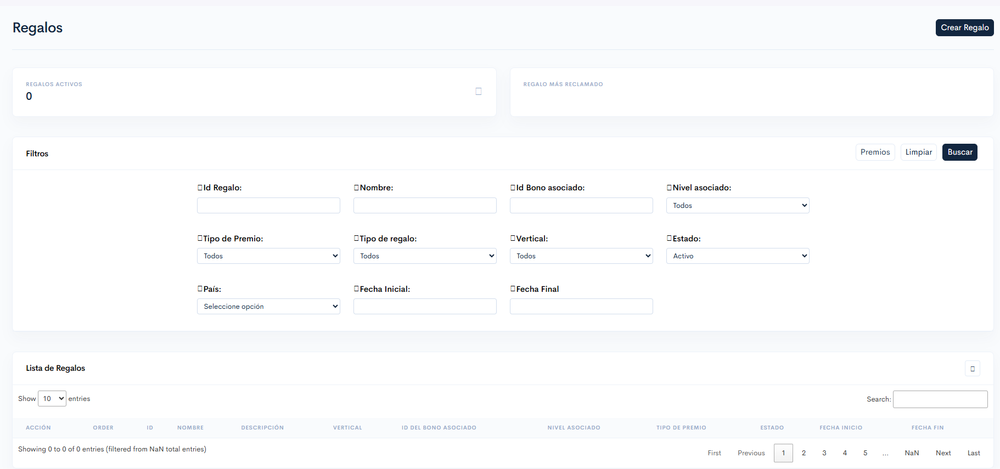

---
layout:
  width: default
  title:
    visible: true
  description:
    visible: false
  tableOfContents:
    visible: true
  outline:
    visible: true
  pagination:
    visible: true
  metadata:
    visible: true
  tags:
    visible: true
  actions:
    visible: true
---

# Regalos.

<mark style="color:$info;">Administra los regalos configurados en la plataforma, facilitando su consulta, seguimiento y gestión. Desde esta sección es posible crear nuevos regalos, realizar búsquedas mediante filtros, visualizar la información de los registros existentes y ejecutar acciones como editar, modificar el orden o inactivar un regalo</mark>

***

### 1. Acceso al Módulo

**Ruta de Acceso:** BackOffice > Torneos y bonos > Menú lateral > Regalos

***

### 2. Visualización

<figure><figcaption>
Figura #1: Captura de pantalla sección regalos.
</figcaption></figure>

***

### 3. Acciones disponibles

<table><thead><tr><th width="138">Acción</th><th>Descripción</th></tr></thead><tbody><tr><td><strong>Filtros</strong></td><td>Permiten realizar búsquedas específicas de regalos utilizando diferentes criterios de consulta.</td></tr><tr><td><strong>Limpiar</strong></td><td>Restablece los filtros aplicados y muestra nuevamente todos los registros disponibles.</td></tr><tr><td><strong>Buscar</strong></td><td>Ejecuta la consulta utilizando los filtros seleccionados.</td></tr><tr><td><strong>Premios</strong></td><td>Redirecciona al módulo donde se visualizan los premios entregados mediante los regalos creados.</td></tr><tr><td><a href="../../crear-eventos./crear-regalo.md"><strong>Crear Regalo</strong></a></td><td>Redirecciona al formulario de creación de un nuevo regalo.</td></tr></tbody></table>

***

### 4. K´pis

En la parte superior del módulo se visualizan indicadores _(KPIs)_ que muestran información relevante sobre los regalos configurados en el sistema.&#x20;


**Nota:** Estos indicadores se actualizan de acuerdo con los filtros aplicados en el módulo.


<table><thead><tr><th width="212">KPI</th><th>Descripción</th></tr></thead><tbody><tr><td><strong><code>Cantidad de regalos activos</code></strong></td><td>Cantidad total de regalos que se encuentran activos en el sistema.</td></tr><tr><td><strong><code>Cantidad de regalos redimidos</code></strong></td><td>Muestra el número total de veces que los jugadores han reclamado un regalo.</td></tr><tr><td><strong><code>Cantidad de bonos redimidos del regalo</code></strong></td><td>Total de bonos que han sido redimidos a través de los regalos.</td></tr><tr><td><strong><code>Regalo más reclamado</code></strong></td><td>Nombre del regalo que registra la mayor cantidad de redenciones.</td></tr></tbody></table>

### 5. Filtros

Los filtros que permiten consultar información específica sobre los regalos registrados.

<table><thead><tr><th width="149">Campo</th><th width="140">Tipo</th><th>Descripción</th></tr></thead><tbody><tr><td><strong><code>ID Regalo</code></strong></td><td>Numérico</td><td>Realiza la búsqueda utilizando el identificador único del regalo.</td></tr><tr><td><strong><code>Nombre</code></strong></td><td>Campo de texto</td><td>Realiza la búsqueda por el nombre asignado al regalo.</td></tr><tr><td><strong><code>Id Bono asociado</code></strong></td><td>Numérico</td><td>Consulta los regalos asociados a un bono específico mediante su identificador.</td></tr><tr><td><strong><code>Nivel asociado</code></strong></td><td>Lista desplegable</td><td>Permite consultar los regalos según el nivel al que fueron asociados.</td></tr><tr><td><strong><code>Tipo de premio</code></strong></td><td>Lista desplegable</td><td>Consulta los regalos según el tipo de premio configurado.</td></tr><tr><td><strong><code>Tipo de regalo</code></strong></td><td>Lista desplegable</td><td>Permite consultar los regalos según su tipo <em>(Beneficios , Tienda)</em>.</td></tr><tr><td><strong><code>Vertical</code></strong></td><td>Lista desplegable</td><td>Consulta los regalos según la vertical a la que fueron asociados.</td></tr><tr><td><strong><code>Estado</code></strong></td><td>Lista desplegable</td><td>Consultar los regalos según su estado (<strong>Activo</strong> o <strong>Inactivo</strong>).</td></tr><tr><td><strong><code>País</code></strong></td><td>Lista desplegable</td><td>Permite consultar los regalos creados para un país específico.</td></tr><tr><td><strong><code>Fecha inicial</code></strong></td><td>Selector de fecha</td><td>Filtra los regalos según la fecha de inicio configurada.</td></tr><tr><td><strong><code>Fecha final</code></strong></td><td>Selector de fecha</td><td>Filtra los regalos según la fecha de finalización configurada.</td></tr></tbody></table>

***

### 6. Resultados de consulta

Al realizar una búsqueda, se muestra una tabla con los regalos registrados. De forma predeterminada se muestran todos los registros disponibles; sin embargo, al aplicar filtros, únicamente se visualizarán aquellos que cumplan con los criterios seleccionados.

<table><thead><tr><th width="240">Campo</th><th>Descripción</th></tr></thead><tbody><tr><td><strong>Acciones</strong></td><td>Las acciones disponibles son las siguientes:</td></tr></tbody></table>

***


{% column width="33.33333333333333%" %}



{% column width="66.66666666666667%" %}
<table><thead><tr><th width="99">Acción</th><th>Descripción</th></tr></thead><tbody><tr><td><a href="usuarios-afiliados-al-regalo.md"><strong>👁️</strong></a></td><td>Consulta el detalle de los términos y condiciones configurados para el regalo seleccionado.</td></tr><tr><td><a href="usuarios-afiliados-al-regalo.md"><strong>🔍</strong></a></td><td>Redirecciona a la sección de detalle del regalo, donde se visualiza el listado de usuarios que han accedido al regalo.</td></tr><tr><td><strong>⏻</strong></td><td>Inactiva el regalo seleccionado. Para completar la acción, el sistema solicitará una confirmación mediante una ventana emergente <em>(pop-up)</em>.</td></tr><tr><td><strong>⬆️</strong></td><td>Actualiza el orden de visualización del regalo dentro de la lista, organizándolo de acuerdo con el valor establecido en el campo <strong><code>Order</code></strong>.</td></tr><tr><td><a href="./#id-7.-editar-regalo"><strong>✏️</strong></a></td><td>Modificar la información del regalo seleccionado.</td></tr></tbody></table>



<table data-header-hidden data-search="false"><thead><tr><th width="203">Campo</th><th>Descripción</th></tr></thead><tbody><tr><td><strong><code>Order</code></strong></td><td>Orden del regalo en la lista no afecta el funcionamiento; sin embargo, es posible editarlo.</td></tr><tr><td><strong><code>ID Regalo</code></strong></td><td>Identificador único asignado al regalo.</td></tr><tr><td><strong><code>Nombre Regalo</code></strong></td><td>Nombre asignado al regalo.</td></tr><tr><td><strong><code>Descripción Regalo</code></strong></td><td>Descripción configurada para el regalo.</td></tr><tr><td><strong><code>Vertical</code></strong></td><td>Vertical a la que pertenece el regalo, <em>(Casino, deportivas, etc)</em>.</td></tr><tr><td><strong><code>ID del bono asociado</code></strong></td><td>Identificador único del bono asociado al regalo.</td></tr><tr><td><strong><code>Nivel asociado</code></strong></td><td>Nivel de lealtad asociado al regalo <em>(1, 2, 3 Etc)</em>.</td></tr><tr><td><strong><code>Tipo de premio</code></strong></td><td>Premio configurado para el regalo <em>(Físico, Online).</em></td></tr><tr><td><strong><code>Estado</code></strong></td><td>Estado actual del regalo <em>(Activo o Inactivo)</em>.</td></tr><tr><td><strong><code>Fecha de Inicio</code></strong></td><td>Fecha en la que inicia o inicio la vigencia del regalo.</td></tr><tr><td><strong><code>Fecha de Fin</code></strong></td><td>Fecha en la que finaliza o finalizó la vigencia del regalo.</td></tr></tbody></table>

***

### 7. Editar regalo

Actualización de la información de un regalo previamente creado. Al seleccionar esta acción, se abrirá una ventana emergente con los campos disponibles para su edición.

<table><thead><tr><th width="143">Campo</th><th width="147">Tipo</th><th width="457">Descripción</th></tr></thead><tbody><tr><td><strong><code>ID</code></strong></td><td>Numérico</td><td>Identificador único del regalo. <em>(Este campo es de solo lectura y no puede ser modificado)</em>.</td></tr><tr><td><strong><code>Nombre del regalo</code></strong></td><td>Campo de texto</td><td>Nombre asignado al regalo. <em>(Puede modificarse para actualizar la información).</em></td></tr><tr><td><strong><code>Descripción</code></strong></td><td>Campo de texto</td><td>Descripción del regalo. <em>(Esta información puede ser actualizada)</em>.</td></tr><tr><td><strong><code>URL Imagen Principal</code></strong></td><td>Campo de texto</td><td>Dirección URL de la imagen principal asociada al regalo. <em>(Puede modificarse para actualizar la imagen mostrada).</em></td></tr><tr><td><strong><code>Descripción Premio físico</code></strong></td><td>Campo de texto</td><td>Descripción del premio físico asociado al regalo. <em>(Puede actualizarse según la información requerida).</em></td></tr><tr><td><strong><code>Orden visualización</code></strong></td><td>Numérico</td><td>Define el orden en el que se visualiza el regalo dentro de la plataforma. <em>(Esta Información modificarse).</em></td></tr></tbody></table>

***

### 8. Validaciones y reglas del negocio

* El campo **ID** del regalo es generado automáticamente por el sistema y no puede modificarse.
* La acción **Inactivar Regalo** solicita una confirmación antes de ejecutar el cambio de estado.
* La acción **Editar** únicamente permite modificar los campos habilitados por el sistema.
* El botón **Premios** redirecciona al módulo correspondiente para consultar los premios entregados mediante los regalos.

***

### 9. Control de Versiones

🔽Historial de versiones

<table><thead><tr><th width="108">Versión</th><th width="138">Fecha</th><th width="146">Autor</th><th>Cambios Realizados</th></tr></thead><tbody><tr><td>1.0</td><td>08/07/2026</td><td>Karol Navia</td><td>Reestructuración del manual</td></tr></tbody></table>

