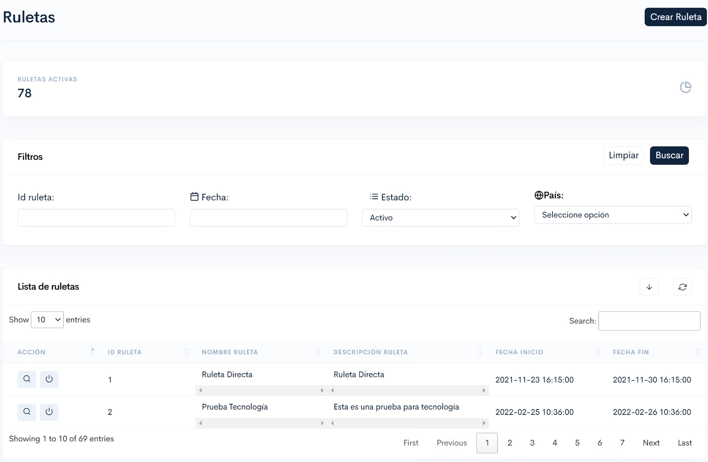

# Ruletas.

Una vez dentro, tendrás disponible lo siguiente:

<figure><figcaption>
Figura #1: Captura de pantalla sección visualizar Ruletas.
</figcaption></figure>

Inicialmente, verás la opción para crear una ruleta mediante el botón "**Crear Ruleta**" ubicado en la parte superior derecha. Este botón te enviará a la sección destinada para la creación de la ruleta. Para obtener más información, puedes acceder a la siguiente página.


[Broken link](/broken/pages/BNf48QMXjBpNZzSNivop)


### Ruletas activas:

Tendremos disponible el apartado de Ruletas activas, en este apartado podremos visualizar directamente cuántas Ruletas hay activas en el momento de ingresar a esta sección.

<figure><figcaption>
Figura #2: Captura de pantalla Ruletas activas.
</figcaption></figure>

### filtros:

En el apartado de filtros encontrarás opciones para visualizar información más detallada, adaptándose a las necesidades específicas que puedan surgir al realizar una búsqueda.

<figure><figcaption>
Figura #3: Captura de pantalla Filtros.
</figcaption></figure>

* **ID Ruleta:** Permite buscar información filtrando únicamente por el ID de la ruleta.
* **Fecha:** Facilita la búsqueda por rango de fechas en las que la ruleta fue creada.
* **Estado:** Permite realizar búsquedas según el estado de la ruleta, ya sea **activo** o **inactivo**.
* **País:** Permite filtrar las ruletas según el país para el cual fueron creadas.

Una vez hayas completado todos los filtros necesarios para la búsqueda, haz clic en el botón "**Buscar**", ubicado en la parte superior derecha del apartado de filtros. Si necesitas eliminar los filtros aplicados, puedes hacer clic en el botón "**Limpiar**", que también se encuentra en la misma ubicación.

### Lista de ruletas:

En este apartado podrás visualizar las ruletas creadas. Inicialmente, se mostrarán todas las ruletas disponibles. Sin embargo, al utilizar los filtros mencionados anteriormente, podrás visualizar la información de manera filtrada según tus necesidades.

<figure><figcaption>
Figura #4: Captura de pantalla Lista de ruletas.
</figcaption></figure>

Dichas ruletas se muestran en una tabla interactiva. La primera columna permite realizar acciones específicas relacionadas con cada ruleta, en las columnas restantes solo podrás visualizar información.

*   **Lupa**: Esta acción te permite ingresar a un apartado en el que encontrarás información general sobre los premios de la ruleta, el cual se verá de la siguiente manera: 

    <figure><figcaption>
Figura #5: Captura de pantalla Ranking Ruleta.
</figcaption></figure>

    * **Participantes:** Podrás ver la cantidad de usuarios que han participado en la ruleta.
    * **Dinero real:** Podrás visualizar la cantidad de dinero acumulado por la ruleta.
    * [**GGR**](https://app.gitbook.com/o/QcwavWzh0dfIwPyknoIT/s/mbqa0WvDWam8G20QQoIZ/#ggr) **(Ingresos Brutos por Juego):** Podrás consultar las ganancias generadas por la ruleta, que reflejan la diferencia entre lo apostado y lo ganado por los jugadores.
    * **Progreso Ruleta:** Aquí podrás ver el porcentaje de avance de la ruleta, lo que indica el progreso hasta el momento.
    * **Filtros**: Podrás filtrar información de la tala "**Ranking Usuarios**" utilizando los siguientes filtros:
      * **ID**: Indica el ID del premio.
      * **Usuario Id**: Indica el ID del usuario premiado.
      * **Nombre**: Indica el nombre del usuario premiado.
    * **Tabla Ranking Usuarios**: En esta tabla encontrarás información sobre los usuarios que han ganado premios en la ruleta, con las siguientes columnas:
      * **ID**: Id del premio.
      * **Usuario**: Id del usuario premiado.
      * **Nombre**: Nombre de usuario premiado.
      * **Apuestas**: Valor apostado por el usuario.
      * **Estado**: Estado del premio.
      * **Descripción premio**: Descripción del premio ganado.
* **Inactivar Ruleta**: Al dar clic en este ícono, se desplegará un pop-up en el cual deberás confirmar si deseas inactivar la ruleta.
* **ID** Rulet&#x61;**:** En esta columna podrás ver el ID único asignado a cada ruleta.
* **Nombre Ruleta:** En esta columna encontrarás el nombre asignado a cada ruleta.
* **Descripción Ruleta:** En esta columna podrás visualizar una breve descripción que proporciona detalles sobre la ruleta y sus características.
* **Fecha Inicio**: Indica la fecha en la que la ruleta comenzó a estar disponible.
* **Fecha Fin**: Muestra la fecha en la que la ruleta dejó de estar disponible.
