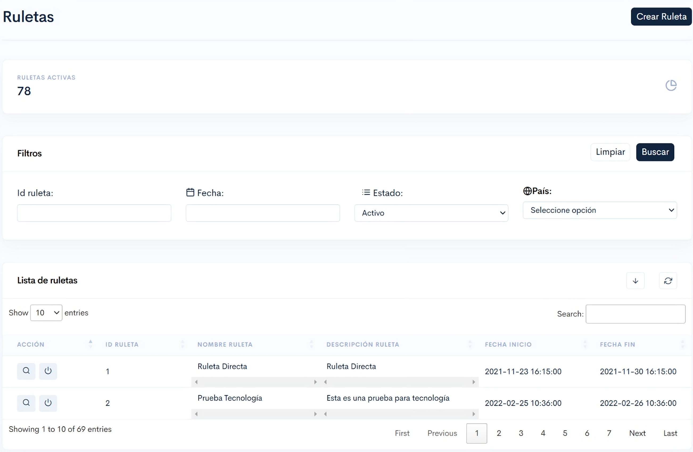

---
layout:
  width: default
  title:
    visible: true
  description:
    visible: false
  tableOfContents:
    visible: true
  outline:
    visible: true
  pagination:
    visible: true
  metadata:
    visible: true
  tags:
    visible: true
  actions:
    visible: true
  anchors:
    visible: true
---

# Ruletas.

Visualiza y gestiona las ruletas previamente creadas para la plataforma Usuarios Online.

### 1. Acceso al Módulo

**Ruta de Acceso**: BackOffice > Torneos y bonos > ver ruletas

***

### 2. Visualización

<figure><figcaption>
Figura #1: Captura de pantalla sección visualizar Ruletas.
</figcaption></figure>

En la parte superior derecha se encuentra el botón **"**[**Crear ruleta**](https://virtualsoft.gitbook.io/manuales/torneos-y-bonos/torneos-y-bonos./como-acceder-a-la-plataforma-./crear-eventos./crear-ruleta.)**"**, el cual dirige a la sección destinada para la creación de ruletas.

### 3. Acciones del usuario

<table><thead><tr><th width="195.5555419921875">Acción</th><th>Descripción</th></tr></thead><tbody><tr><td><strong>Filtrar</strong></td><td>Utiliza los filtros disponibles para buscar ruletas ya creadas.</td></tr><tr><td><strong>Visualizar ruletas activas</strong></td><td>Visualizar en un KPI la cantidad de ruletas activas del partner país previamente seleccionado.</td></tr><tr><td><strong>Lista de ruletas</strong></td><td>En esta tabla se encuentran todas las ruletas disponibles según los filtros aplicados.</td></tr><tr><td><strong>Gestionar ruletas creadas</strong></td><td>Cada ruleta visualizada en la tabla tiene acciones disponibles para su gestión.</td></tr><tr><td><strong>Crear ruleta</strong></td><td>Botón que redirecciona al formulario de <a href="https://virtualsoft.gitbook.io/manuales/torneos-y-bonos/torneos-y-bonos./como-acceder-a-la-plataforma-./crear-eventos./crear-ruleta.">creación de una ruleta</a>.</td></tr></tbody></table>

### 4. Filtros

Los filtros permiten obtener información más detallada de las ruletas, adaptándose a las necesidades de búsqueda.

<table><thead><tr><th width="120.666748046875">Campo</th><th width="135.7777099609375">Tipo de control</th><th>Descripción</th></tr></thead><tbody><tr><td><strong><code>ID ruleta</code></strong></td><td>Numérico</td><td>Buscar información filtrando únicamente por el ID de la ruleta.</td></tr><tr><td><strong><code>Fecha</code></strong></td><td>Calendario</td><td>Busca por rango de fechas en las que la  ruleta fue creada.</td></tr><tr><td><strong><code>Estado</code></strong></td><td>Lista desplegable</td><td>Filtra las ruletas según su estado <em>(<strong>activo</strong> o <strong>inactivo</strong>)</em>.</td></tr><tr><td><strong><code>País</code></strong></td><td>Lista desplegable</td><td>Filtra las ruletas según el país para el cual fueron creados.</td></tr></tbody></table>

Una vez completados los filtros, utiliza el botón **"Buscar"**.\
Para limpiar los criterios aplicados, utilizar el botón **"Limpiar"**.

### 5. Lista de ruletas

En esta sección se muestran todos las ruletas creados. La información se despliega en una tabla interactiva que permite consultar y gestionar detalles de cada sorteo.

<table><thead><tr><th width="188.333251953125">Columna</th><th width="559.666748046875">Descripción</th></tr></thead><tbody><tr><td><strong><code>Acciones</code></strong></td><td>Por cada ruleta visualizada se permiten realizar las siguientes acciones:</td></tr></tbody></table>


{% column width="25%" %}



{% column width="75%" %}
<table><thead><tr><th width="133.1112060546875">Acción</th><th>Descripción</th></tr></thead><tbody><tr><td><a href="ruletas..md#ver-detalle-de-torneo-lupa"><strong>Lupa (🔍)</strong></a></td><td>
Esta acción te permite ingresar a un apartado en el que encontrarás información general sobre los premios de la ruleta.

<a class="button secondary">Ver detalles</a>
</td></tr><tr><td> <strong>Inactivar ruleta (⏻)</strong></td><td>Abre un pop-up para confirmar la inactivación de la ruleta.</td></tr></tbody></table>




***

<table data-header-hidden><thead><tr><th width="206.8887939453125">Columna</th><th>Descripción</th></tr></thead><tbody><tr><td><strong><code>ID ruleta</code></strong></td><td>Identificador único asignado al sorteo.</td></tr><tr><td><strong><code>Nombre ruleta</code></strong></td><td>Nombre definido para el sorteo.</td></tr><tr><td><strong><code>Descripción ruleta</code></strong></td><td>Breve descripción con detalles del sorteo, que esta la visualizaran los usuarios en la plataforma en usuarios online.</td></tr><tr><td><strong><code>Fecha de Inicio</code></strong></td><td>Fecha en la que comenzó el sorteo.</td></tr><tr><td><strong><code>Fecha de Fin</code></strong></td><td>Fecha en la que finalizó el sorteo.</td></tr></tbody></table>

🔽 Ver detalle de la ruleta (<em>🔎 Lupa</em>)

Permite visualizar la información completa de una ruleta.

***

#### Visualización&#x20;

<figure><figcaption>
Figura #2: Captura de pantalla Ranking Ruleta.
</figcaption></figure>

***

#### Kpis generales

Permiten visualizar un resumen general del estado y desempeño del sorteo, a través de los siguientes indicadores:

<table><thead><tr><th width="192.00006103515625">Campo</th><th>Descripción</th></tr></thead><tbody><tr><td><strong><code>Participantes</code></strong></td><td>Número total de usuarios que participan en el sorteo.</td></tr><tr><td><strong><code>Dinero real</code></strong></td><td>Cantidad total de dinero acumulado por la ruleta</td></tr><tr><td><strong><code>GGR</code></strong></td><td>Ganancias generadas por la ruleta, que reflejan la diferencia entre lo apostado y lo ganado por los jugadores.</td></tr><tr><td><strong><code>Progreso del sorteo</code></strong></td><td>Porcentaje de avance de la ruleta según su duración o condiciones configuradas.</td></tr></tbody></table>

***

#### Filtros

<table><thead><tr><th width="132.99993896484375">Campo</th><th width="119.00006103515625">Tipo</th><th>Descripción</th></tr></thead><tbody><tr><td><strong><code>Id</code></strong></td><td>Numérico</td><td>Filtra por una ruleta específica con su identificador único.</td></tr><tr><td><strong><code>Usuario Id</code></strong></td><td>Numérico</td><td>Permite filtrar la información asociada a un usuario específico mediante su identificador único.</td></tr><tr><td><strong><code>Nombre</code></strong></td><td>Texto</td><td>Permite filtrar los resultados por el nombre de los usuarios que participaron en la ruleta.</td></tr></tbody></table>

***

#### Ranking Usuarios&#x20;

Permite visualizar todos los jugadores participantes y consultar los detalles de su participación en el sorteo, a través de los siguientes campos:

<table><thead><tr><th width="175.00006103515625">Campo</th><th>Descripción</th></tr></thead><tbody><tr><td><strong><code>ID</code></strong></td><td>Id del premio.</td></tr><tr><td><strong><code>Usuario</code></strong></td><td>Id del usuario premiado.</td></tr><tr><td><strong><code>Nombre</code></strong></td><td>Nombre de usuario premiado.</td></tr><tr><td><strong><code>Apuestas</code></strong></td><td>Valor apostado por el usuario.</td></tr><tr><td><strong><code>Estado</code></strong></td><td>Estado del premio.</td></tr><tr><td><strong><code>Descripción premio</code></strong></td><td>Descripción del premio obtenido por el usuario.</td></tr></tbody></table>

***

### 4. Control de Versiones

 🕒Historial de versiones.

<table><thead><tr><th width="107.88897705078125">Versión</th><th width="132.111083984375">Fecha</th><th width="170.333251953125">Autor</th><th>Cambios Realizados</th></tr></thead><tbody><tr><td>1.0</td><td>2026-09-17</td><td>Ronald Pelaez</td><td>Documento inicial</td></tr></tbody></table>

