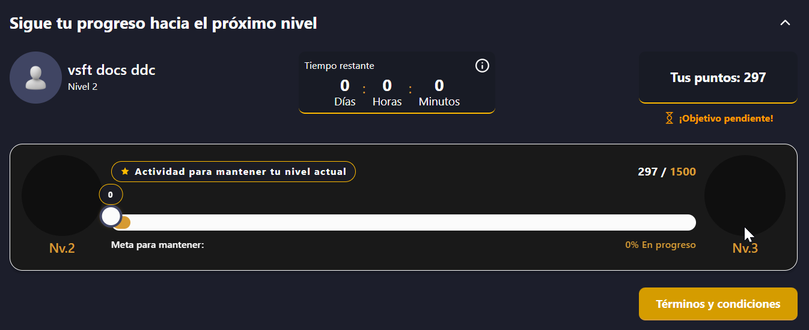

# Puntos lealtad

### 1. Acceso al Módulo:


**Nota**: Para este módulo cada partner tiene una ruta y nombre diferente.

* **Panilpay**: Menú principal > Leyendas paniplay.
* **Ganaplay**: Menú en barra superior > Lealtad.
* **Ecuabet**: Servicios > Gestión > Club Oro.
* **Doradobet**: Menú lateral > DoradoClub.


***

### 2. Acciones del Usuario

<table><thead><tr><th width="158.09088134765625">Sección</th><th>Descripción</th></tr></thead><tbody><tr><td><strong>Dorado Club</strong></td><td>Conoce como obtener puntos lealtad para redimir premios.</td></tr><tr><td><strong>Niveles lealtad</strong></td><td>Visualiza los niveles lealtad disponibles junto con los premios de cada nivel <em>(si aplica).</em></td></tr><tr><td><a href="https://virtualsoft.gitbook.io/manuales/usuarios/~/revisions/otPnnNfVwo3XtBsBUvOX/usuarios-online/manual-de-plataforma/puntos-lealtad/tienda-de-premios-lealtad."><strong>Ir a la tienda de premios</strong></a></td><td>Despliega los premios disponibles para redimir.</td></tr><tr><td><strong>Puntos calificables</strong></td><td>Visualiza una tabla con el historial de movimientos de los puntos calificables.</td></tr><tr><td><strong>Transacciones</strong></td><td>Visualiza el historial de transacciones tanto de los puntos calificables como de los puntos lealtad. </td></tr><tr><td><strong>Cambios de nivel</strong></td><td>Visualiza el historial de cambios en los niveles lealtad.</td></tr></tbody></table>

***

### 3. Contenido del módulo

Este módulo está organizado en tres secciones principales que permanecen distribuidas a lo largo de la pantalla:

* [**Sección superior**](https://virtualsoft.gitbook.io/manuales/usuarios/usuarios-online/manual-de-plataforma/puntos-lealtad#id-2.-acciones-del-usuario)**:** Contiene el menú de navegación con los diferentes apartados del módulo. Este menú permanecerá siempre visible para facilitar el acceso a cualquier opción disponible.
* **Sección central:** Presenta una tarjeta con la información del progreso del usuario hacia el siguiente nivel. Esta sección es fija y se mantiene visible independientemente de la opción seleccionada.

<strong>Progreso hacia el próximo nivel</strong>

**Visualización**

<figure><figcaption>
Figura #1: Captura de pantalla progreso de niveles lealtad.
</figcaption></figure>

<table><thead><tr><th width="162">Sección</th><th>Descripción</th></tr></thead><tbody><tr><td><strong><code>Tiempo restante</code></strong></td><td>Visualiza un contador con el tiempo restante en el nivel actual.</td></tr><tr><td><strong><code>Información del perfil</code></strong></td><td>Visualiza la foto de perfil de la cuenta, el nombre y debajo el nivel lealtad.</td></tr><tr><td><strong><code>Tus puntos</code></strong></td><td>Cantidad actual de puntos lealtad</td></tr><tr><td><strong><code>Tarjeta de nivel lealtad</code></strong></td><td>visualiza una tarjeta que contiene una barra que indica la cantidad de puntos que se tiene comparado con la cantidad de puntos que se necesita para el siguiente nivel.</td></tr><tr><td><strong><code>Términos y condiciones</code></strong></td><td>Visualiza los términos y condiciones generales de los niveles lealtad</td></tr></tbody></table>

* **Sección inferior:** Muestra el contenido correspondiente a la opción seleccionada en el menú superior. Esta es la única sección cuyo contenido cambia según el apartado elegido.



























### 4. Validaciones y Reglas de Negocio

* Los puntos solo se otorgan por apuestas con dinero real.
* Los puntos se actualizan en tiempo real según las apuestas.
* Los premios están sujetos a disponibilidad y pueden variar por campaña.
* Algunas recompensas requieren verificación de identidad previa al canje.
* Los puntos tienen una vigencia limitada y pueden expirar si no se usan.
* Si ya está en el nivel máximo, en la barra de progreso no se visualizará un siguiente nivel, se visualizará un mensaje indicando "**Meta alcanzada**"

***

### 6. Control de Versiones

Historial de versiones

| Versión | Fecha      | Autor         | Cambios Realizados                     |
| ------- | ---------- | ------------- | -------------------------------------- |
| 1.0     | 21/07/2025 | Karol Navia   | Versión inicial del módulo Dorado Club |
| 1.1     | 28/11/2025 | Ronald Peláez | Refinamiento de manual.                |
| 2.0     | 21/07/2025 | Ronald Peláez | Reestructura del módulo.               |

